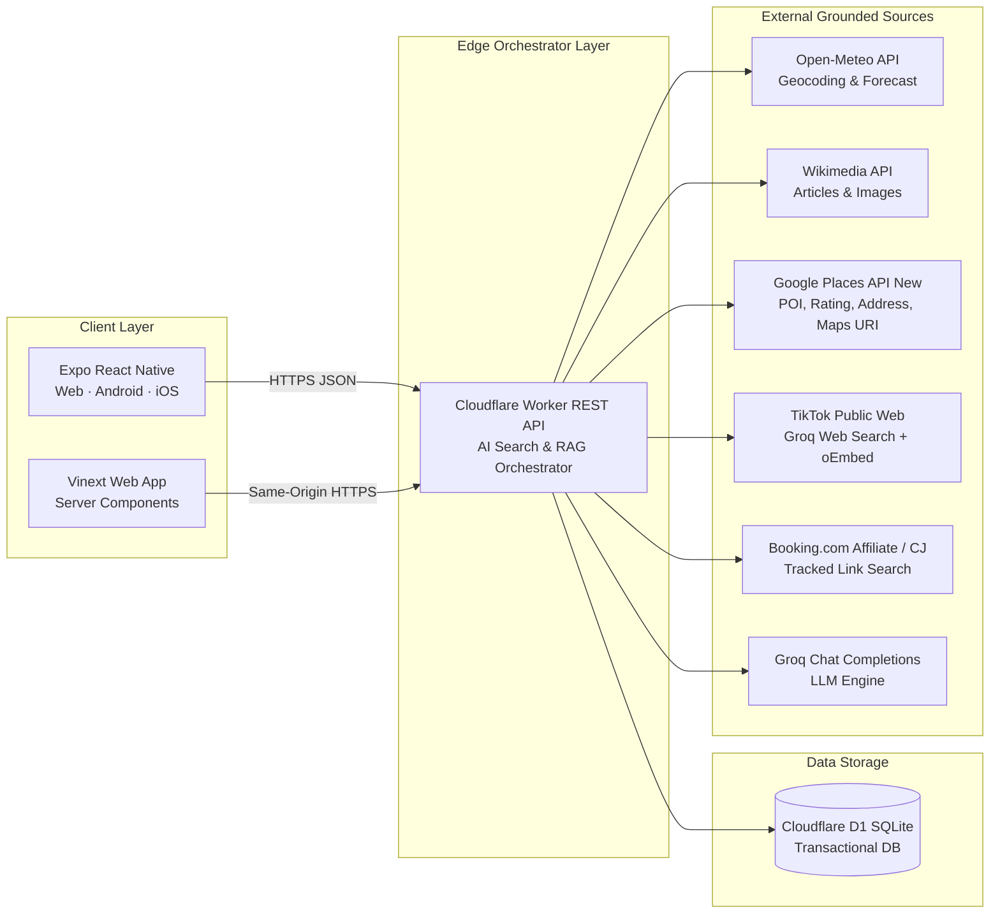
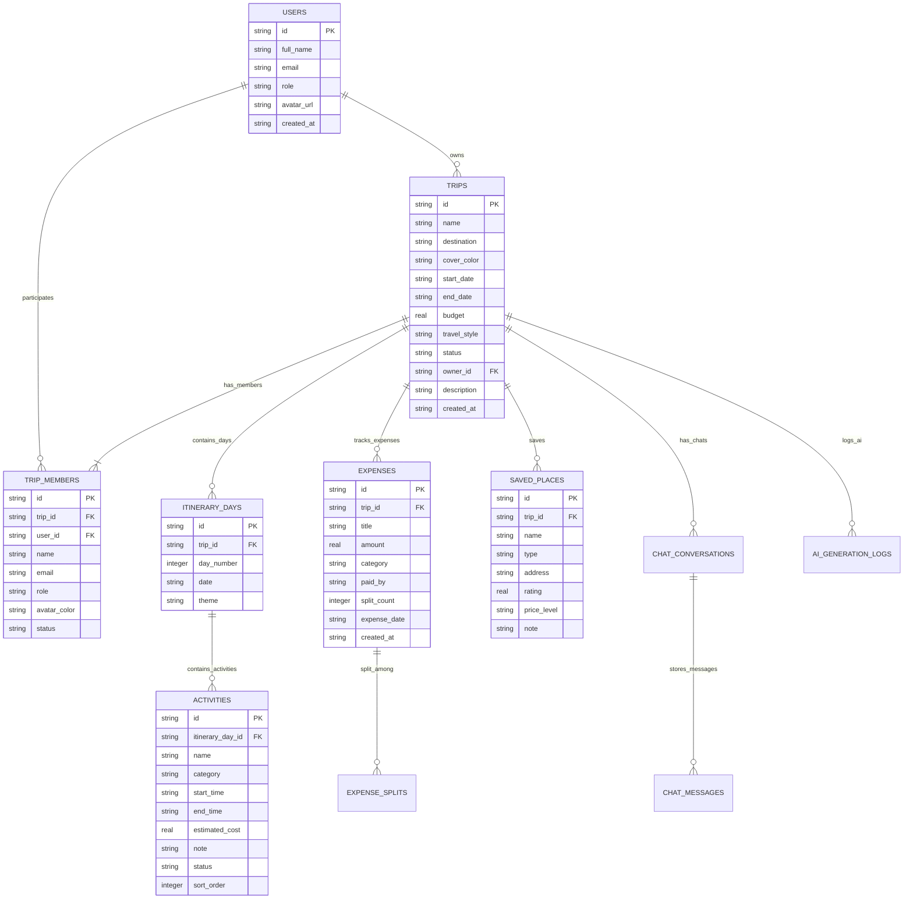
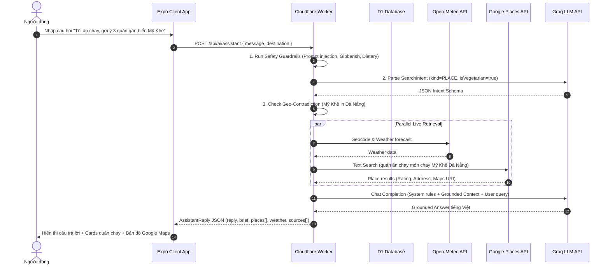

# BÁO CÁO PHÂN TÍCH VÀ THIẾT KẾ HỆ THỐNG
## DỰ ÁN: TRAVELMATE AI – TRỢ LÝ LẬP KẾ HOẠCH DU LỊCH & QUẢN LÝ CHUYẾN ĐI NHÓM

> **Học phần:** Đồ án Chuyên ngành 2 (DACN2)  
> **Nền tảng:** Web & Mobile App (Expo React Native / Cloudflare Worker / Cloudflare D1 / Groq LLM)  
> **Ngày hoàn thành:** 04/08/2026 | **Hạn nộp bài:** 05/08/2026  
> **Trạng thái:** Báo cáo Phân tích Thiết kế Chuẩn chính thức (Canonical Specification V2)

---

# 📖 MỤC LỤC

1. [CHƯƠNG 1: TỔNG QUAN VÀ KIẾN TRÚC HỆ THỐNG](#chuong-1-tong-quan-va-kien-truc-he-thong)
   - 1.1 Mục tiêu bài toán
   - 1.2 Phạm vi hệ thống (MVP Scope)
   - 1.3 Kiến trúc tổng thể hệ thống (Serverless Orchestrator)
   - 1.4 Phân định trách nhiệm các thành phần
2. [CHƯƠNG 2: SƠ ĐỒ USE-CASE VÀ ĐẶC TẢ CHI TIẾT](#chuong-2-so-do-use-case-va-dac-ta-chi-tiet)
   - 2.1 Các Actor trong hệ thống
   - 2.2 Sơ đồ Use-Case tổng thể
   - 2.3 Phân rã & Đặc tả Use-Case chi tiết
3. [CHƯƠNG 3: MÔ HÌNH DỮ LIỆU ERD VÀ TỪ ĐIỂN DỮ LIỆU](#chuong-3-mo-hinh-du-lieu-erd-va-tu-dien-du-lieu)
   - 3.1 Sơ đồ mối quan hệ thực thể (ERD Diagram)
   - 3.2 Từ điển dữ liệu chi tiết (D1 SQLite Tables)
   - 3.3 Các ràng buộc toàn vẹn & Transaction Rules
4. [CHƯƠNG 4: SƠ ĐỒ TUẦN TỰ (SEQUENCE DIAGRAMS)](#chuong-4-so-do-tuan-tu-sequence-diagrams)
   - 4.1 SD-01: Quy trình Xác thực & Bootstrap Dữ liệu Người dùng
   - 4.2 SD-02: Quy trình RAG Live Search & AI Travel Assistant
   - 4.3 SD-03: Quy trình Sinh Lịch trình AI Draft & Transaction Apply
   - 4.4 SD-04: Quy trình Thêm Chi phí & Phân chia Ngân sách
5. [CHƯƠNG 5: HỢP ĐỒNG API VÀ THIẾT KẾ AN TOÀN BẢO MẬT](#chuong-5-hop-dong-api-va-thiet-ke-an-toan-bao-mat)
   - 5.1 Danh sách API Endpoints chuẩn V2
   - 5.2 Cơ chế Bảo vệ Safety & Guardrails Layer (Anti-Injection, Geo-Contradiction, Gibberish Filter)
   - 5.3 Yêu cầu Phi chức năng (Non-Functional Requirements)

---

<a name="chuong-1-tong-quan-va-kien-truc-he-thong"></a>
# CHƯƠNG 1: TỔNG QUAN VÀ KIẾN TRÚC HỆ THỐNG

## 1.1 Mục tiêu bài toán

Trong bối cảnh du lịch hiện đại, người dùng và các nhóm bạn thường gặp phải ba thách thức chính:
1. **Dữ liệu phân tán:** Thông tin thời tiết, địa điểm ăn uống, giá phòng, lịch trình và chi phí nằm ở nhiều ứng dụng độc lập.
2. **Xung đột sở thích nhóm:** Khó thống nhất nhịp đi, ngân sách và nhu cầu đặc thù (ví dụ: ăn chay, hạn chế đi bộ, người lớn tuổi).
3. **AI Bị mộng tưởng (Hallucination):** Các chatbot AI thông thường dễ tự tạo địa điểm giả, rating hư cấu hoặc sai thông tin giờ mở cửa/tọa độ do không có nguồn truy xuất thực tế.

**TravelMate AI** được thiết kế nhằm giải quyết triệt để các bài toán trên thông qua giải pháp **Grounded RAG Engine** (truy xuất dữ liệu sống từ Open-Meteo, Google Places, Wikimedia, TikTok Web, Booking.com) kết hợp với mô hình quản lý lịch trình nhóm phân quyền (OWNER/EDITOR/VIEWER).

---

## 1.2 Phạm vi hệ thống (MVP Scope)

### Trong phạm vi MVP:
- **Định danh người dùng:** Xác thực Web/Mobile identity.
- **Quản lý Chuyến đi (Trip CRUD):** Tạo, cập nhật, nhân bản, xóa chuyến đi và phân quyền thành viên.
- **Quản lý Lịch trình:** Tạo ngày hành trình, quản lý hoạt động (thời gian, chi phí dự kiến, trạng thái PLANNED/DONE).
- **Quản lý Chi phí:** Thêm khoản chi, phân loại danh mục, tính tổng ngân sách đã dùng.
- **RAG AI Search Layer:** Phân tích Natural Language Intent $\rightarrow$ Truy xuất dữ liệu đa nguồn (Thời tiết real-time, Google Places rating/địa chỉ, bài viết Wikimedia, video TikTok công khai, Booking affiliate) $\rightarrow$ Tổng hợp câu trả lời kèm `sources` nguồn dẫn chứng.
- **AI Itinerary Generator & Apply:** Sinh bản nháp lịch trình (Draft Preview), kiểm tra Transaction và áp dụng chính thức vào chuyến đi mà không làm mất dữ liệu cũ.
- **Guardrail Safety Layers:** Bộ lọc chống Prompt Injection, kiểm tra mâu thuẫn địa lý (Geo-Contradiction), xử lý ràng buộc ăn chay (Dietary Restrictions) và phân loại input rác (Gibberish Input).

---

## 1.3 Kiến trúc tổng thể hệ thống (Serverless Orchestrator)

Hệ thống tuân thủ kiến trúc **Cloud-native Edge Orchestrator V2**:



---

## 1.4 Phân định trách nhiệm các thành phần

| Component | Công nghệ | Trách nhiệm chính |
|---|---|---|
| **Client Layer** | Expo React Native, Vinext, Zustand | Giao diện responsive (Web/Mobile), quản lý state cục bộ, hiển thị empty/loading/error states, client-side fallback engine |
| **Backend Orchestrator** | Cloudflare Worker (TypeScript) | Routing, xác thực & phân quyền, validation, gọi API bên ngoài song song (RAG), kiểm tra Guardrail bảo mật, định dạng JSON cho AI |
| **Database Layer** | Cloudflare D1 (SQLite) | Lưu trữ bền vững thông tin users, trips, trip_members, itinerary_days, activities, expenses, saved_places, chat, logs |
| **External Live Data** | Open-Meteo, Wikimedia, Google Places, TikTok, Booking | Cung cấp tọa độ, dự báo thời tiết, bài giới thiệu, POI rating, video ngắn và link đặt phòng thực tế |
| **LLM Layer** | Groq API (Llama 3 / Mixtral) | Phân tích intent, xếp hạng địa điểm trong tập truy xuất, sinh câu trả lời tiếng Việt có dẫn nguồn |

---

<a name="chuong-2-so-do-use-case-va-dac-ta-chi-tiet"></a>
# CHƯƠNG 2: SƠ ĐỒ USE-CASE VÀ ĐẶC TẢ CHI TIẾT

## 2.1 Các Actor trong hệ thống

1. **Guest (Khách):** Người dùng chưa đăng nhập, chỉ có thể xem màn hình giới thiệu.
2. **Registered User (Người dùng đã đăng nhập):** Tạo chuyến đi mới, xem danh sách chuyến đi cá nhân, sử dụng AI Assistant tìm kiếm địa điểm.
3. **Trip Owner (Chủ chuyến đi):** Có toàn quyền (Tạo, Sửa, Nhân bản, Xóa chuyến đi, Mời thành viên, Phân quyền EDITOR/VIEWER).
4. **Trip Editor (Thành viên chỉnh sửa):** Thêm/Sửa hoạt động lịch trình, thêm chi phí, áp dụng AI Draft.
5. **Trip Viewer (Thành viên chỉ xem):** Xem lịch trình, xem chi phí, không có quyền sửa đổi.
6. **TravelMate AI System:** Trợ lý ảo thực thi quy trình RAG, phân tích intent, gỡ xung đột và sinh lịch trình.

---

## 2.2 Sơ đồ Use-Case tổng thể

```mermaid
usecaseDiagram
    actor "Registered User" as User
    actor "Trip Owner" as Owner
    actor "Trip Editor" as Editor
    actor "TravelMate AI" as AI System

    User <|-- Owner
    Owner <|-- Editor

    package "Quản lý Chuyến đi & Ngân sách" {
        usecase "UC-01: Đăng nhập / Bootstrap Session" as UC1
        usecase "UC-02: Tạo chuyến đi mới" as UC2
        usecase "UC-03: Cập nhật / Xóa / Nhân bản chuyến đi" as UC3
        usecase "UC-04: Mời thành viên & Phân quyền" as UC4
        usecase "UC-05: Quản lý Hoạt động Lịch trình" as UC5
        usecase "UC-06: Thêm & Phân chia Chi phí" as UC6
    }

    package "Travel AI & Grounded Search" {
        usecase "UC-07: Tìm kiếm Địa điểm & Thời tiết Real-time" as UC7
        usecase "UC-08: Hỏi đáp AI Trợ lý (Travel Assistant)" as UC8
        usecase "UC-09: Sinh Bản nháp Lịch trình (AI Draft)" as UC9
        usecase "UC-10: Áp dụng Bản nháp (Apply Draft)" as UC10
    }

    User --> UC1
    User --> UC2
    Owner --> UC3
    Owner --> UC4
    Editor --> UC5
    Editor --> UC6

    User --> UC7
    User --> UC8
    Editor --> UC9
    Editor --> UC10

    UC7 .-> AI System : <<include>>
    UC8 .-> AI System : <<include>>
    UC9 .-> AI System : <<include>>
```

---

## 2.3 Phân rã & Đặc tả Use-Case chi tiết

### Đặc tả UC-08: Hỏi đáp AI Trợ lý (Travel AI Assistant)

- **Mục đích:** Người dùng đặt câu hỏi bằng ngôn ngữ tự nhiên (ví dụ: *"Tôi ăn chay, gợi ý 3 quán ăn sáng gần biển Mỹ Khê"*). AI phân tích intent, truy xuất dữ liệu sống và trả về câu trả lời chuẩn xác.
- **Tác nhân:** Registered User, TravelMate AI System.
- **Tiền điều kiện:** Người dùng đã mở màn hình Travel AI.
- **Luồng sự kiện chính (Main Flow):**
  1. Người dùng nhập câu hỏi và gửi request.
  2. Frontend gửi request `POST /api/ai/assistant` đến Worker Backend.
  3. Worker kiểm tra Guardrail Safety Layers:
     - Check Prompt Injection $\rightarrow$ Nếu phát hiện: Trả về lời từ chối bảo mật.
     - Check Gibberish Input $\rightarrow$ Nếu phát hiện: Trả về yêu cầu diễn đạt lại.
     - Check Dietary Restriction (Ăn chay) $\rightarrow$ Thêm cờ `isVegetarian = true`.
  4. Worker gọi Groq LLM để parse intent ra JSON Schema (`destination`, `kind`, `categories`...).
  5. Worker kiểm tra mâu thuẫn địa lý (`checkGeographicalContradiction`).
  6. Worker thực hiện truy xuất song song (Parallel RAG):
     - เรียก Open-Meteo lấy thời tiết.
     - เรียก Google Places API (New) lấy POI, rating, address, googleMapsUri.
     - เรียก TikTok Web Search lấy video công khai liên quan.
     - เรียก Booking Affiliate CJ lấy link đặt phòng.
  7. Worker tổng hợp dữ liệu, gửi Prompt + Trust Context cho Groq LLM sinh câu trả lời tiếng Việt.
  8. Worker trả về client kết quả kèm mảng `sources[]` nguồn dẫn chứng.
  9. Frontend hiển thị câu trả lời, danh sách card địa điểm, dự báo thời tiết và các tab tích hợp.
- **Ngoại lệ (Exception Flow):**
  - *Mất kết nối mạng / Backend lỗi:* Client-side Engine (`travel-api.ts`) tự động kích hoạt, xử lý đầy đủ các quy tắc Ăn chay, Geo-contradiction, Prompt Injection và Gibberish để không đứt gãy trải nghiệm.

---

<a name="chuong-3-mo-hinh-du-lieu-erd-va-tu-dien-du-lieu"></a>
# CHƯƠNG 3: MÔ HÌNH DỮ LIỆU ERD VÀ TỪ ĐIỂN DỮ LIỆU

## 3.1 Sơ đồ mối quan hệ thực thể (ERD Diagram)



---

## 3.2 Từ điển dữ liệu chi tiết (D1 SQLite Tables)

### Bảng `users`
| Tên cột | Kiểu dữ liệu | Ràng buộc | Mô tả |
|---|---|---|---|
| `id` | TEXT | PRIMARY KEY | ID định danh người dùng |
| `full_name` | TEXT | NOT NULL | Họ và tên |
| `email` | TEXT | NOT NULL, UNIQUE | Email người dùng |
| `role` | TEXT | NOT NULL, DEFAULT 'USER' | Vai trò hệ thống (`USER`, `ADMIN`) |
| `avatar_url` | TEXT | NULLABLE | URL ảnh đại diện |
| `created_at` | TEXT | NOT NULL | Thời điểm tạo ISO-8601 |

### Bảng `trips`
| Tên cột | Kiểu dữ liệu | Ràng buộc | Mô tả |
|---|---|---|---|
| `id` | TEXT | PRIMARY KEY | ID chuyến đi |
| `name` | TEXT | NOT NULL | Tên chuyến đi |
| `destination` | TEXT | NOT NULL | Điểm đến (ví dụ: Đà Nẵng) |
| `cover_color` | TEXT | NOT NULL, DEFAULT 'sunset' | Màu nền/theme bìa |
| `start_date` | TEXT | NOT NULL | Ngày bắt đầu (YYYY-MM-DD) |
| `end_date` | TEXT | NOT NULL | Ngày kết thúc (YYYY-MM-DD) |
| `budget` | REAL | NOT NULL, DEFAULT 0 | Tổng ngân sách dự kiến (VND) |
| `travel_style` | TEXT | NOT NULL, DEFAULT 'Khám phá' | Phong cách du lịch |
| `status` | TEXT | NOT NULL, DEFAULT 'UPCOMING' | Trạng thái (`UPCOMING`, `ONGOING`, `FINISHED`) |
| `owner_id` | TEXT | NOT NULL, FK(users.id) | ID người tạo chuyến đi |
| `description` | TEXT | NOT NULL, DEFAULT '' | Mô tả chi tiết |
| `created_at` | TEXT | NOT NULL | Thời điểm tạo ISO-8601 |

### Bảng `trip_members`
| Tên cột | Kiểu dữ liệu | Ràng buộc | Mô tả |
|---|---|---|---|
| `id` | TEXT | PRIMARY KEY | ID bản ghi thành viên |
| `trip_id` | TEXT | NOT NULL, FK(trips.id) | ID chuyến đi |
| `user_id` | TEXT | NOT NULL, FK(users.id) | ID người dùng |
| `name` | TEXT | NOT NULL | Tên hiển thị trong nhóm |
| `email` | TEXT | NOT NULL | Email thành viên |
| `role` | TEXT | NOT NULL, DEFAULT 'VIEWER' | Quyền hạn (`OWNER`, `EDITOR`, `VIEWER`) |
| `status` | TEXT | NOT NULL, DEFAULT 'ACTIVE' | Trạng thái (`PENDING`, `ACTIVE`) |

---

## 3.3 Các ràng buộc toàn vẹn & Transaction Rules

1. **Ràng buộc Quyền hạn (Role Authorization):** Chỉ `OWNER` mới có quyền chỉnh sửa/xóa chuyến đi và gửi lời mời thành viên. `EDITOR` được quyền tạo hoạt động và chi phí. `VIEWER` chỉ có quyền đọc.
2. **Cascading Deletion:** Khi xóa một `trip`, hệ thống tự động xóa toàn bộ `activities`, `itinerary_days`, `expenses`, `saved_places`, `chat_messages`, `chat_conversations` và `trip_members` liên quan trong 1 D1 Batch Transaction.
3. **AI Apply Transaction:** Khi áp dụng lịch trình từ AI Draft (`POST /api/ai/itinerary/apply`), thao tác chèn ngày (`itinerary_days`) và hoạt động (`activities`) được thực thi nguyên tử (atomic transaction) để tránh tình trạng mất dữ liệu dở dang.

---

<a name="chuong-4-so-do-tuan-tu-sequence-diagrams"></a>
# CHƯƠNG 4: SƠ ĐỒ TUẦN TỰ (SEQUENCE DIAGRAMS)

## 4.1 SD-02: Quy trình RAG Live Search & AI Travel Assistant



---

<a name="chuong-5-hop-dong-api-va-thiet-ke-an-toan-bao-mat"></a>
# CHƯƠNG 5: HỢP ĐỒNG API VÀ THIẾT KẾ AN TOÀN BẢO MẬT

## 5.1 Danh sách API Endpoints chuẩn V2

| Method | Endpoint | Authorization | Mô tả |
|---|---|---|---|
| `GET` | `/api/weather?location=` | Public | Geocoding & dự báo thời tiết real-time từ Open-Meteo |
| `GET` | `/api/places?query=&limit=` | Public | Tìm kiếm bài viết & hình ảnh địa điểm từ Wikimedia |
| `GET` | `/api/places/featured` | Public | Lấy danh sách địa điểm nổi bật biên tập |
| `GET` | `/api/bootstrap` | User | Khởi tạo dữ liệu người dùng, danh sách trips & thành viên |
| `POST` | `/api/trips` | User | Tạo chuyến đi mới & gán quyền OWNER |
| `PATCH` | `/api/trips/{id}` | Owner/Editor | Cập nhật thông tin chuyến đi (tên, điểm đến, ngân sách...) |
| `DELETE` | `/api/trips/{id}` | Owner | Xóa chuyến đi & cascade các dữ liệu con |
| `POST` | `/api/trips/{id}/duplicate` | Owner/Editor | Nhân bản chuyến đi kèm toàn bộ lịch trình |
| `POST` | `/api/expenses` | Owner/Editor | Thêm khoản chi phí mới cho chuyến đi |
| `POST` | `/api/members/invite` | Owner | Gửi lời mời thành viên tham gia chuyến đi |
| `POST` | `/api/activities/{id}/toggle` | Owner/Editor | Đánh dấu hoàn thành/chưa hoàn thành hoạt động |
| `POST` | `/api/ai/assistant` | Public / User | AI Search Layer cho Expo (Intent + Places + Weather + TikTok + Booking) |
| `POST` | `/api/ai/itinerary` | User | Sinh bản nháp lịch trình tự động (AI Draft) |
| `POST` | `/api/ai/itinerary/apply` | Owner/Editor | Áp dụng bản nháp lịch trình vào D1 Database |

---

## 5.2 Cơ chế Bảo vệ Safety & Guardrails Layer

Hệ thống tích hợp 4 lớp bảo vệ an toàn chủ động:

1. **Lớp chống Prompt Injection (`requestsSensitiveConfiguration`):**
   - Tự động chặn các truy vấn cố tình khai thác `system prompt`, `api key`, `bỏ qua hướng dẫn trước`.
   - Phản hồi câu từ chối bảo mật thay vì sinh nội dung ngẫu nhiên.
2. **Lớp phân loại Input rác (`isGibberishInput`):**
   - Kiểm tra tỷ lệ ký tự đặc biệt ($>20\%$), tỷ lệ chữ cái ($<40\%$), phụ âm gõ phím ngẫu nhiên (4 phụ âm liên tiếp) và đối chiếu từ vựng du lịch.
   - Nhận diện chuỗi ký tự rác (ví dụ: `asdkjaslkdj @#$%^&& 123123 ？？？`) và yêu cầu người dùng diễn đạt lại.
3. **Lớp kiểm tra Mâu thuẫn Địa lý (`checkGeographicalContradiction`):**
   - Xây dựng ma trận danh thắng - thành phố (`LANDMARK_CITY_MAP`).
   - Cảnh báo người dùng khi đặt câu hỏi mâu thuẫn (ví dụ: Mỹ Khê ở Hà Nội).
4. **Lớp xử lý Ràng buộc Ăn chay (`dietaryConstraints`):**
   - Tự động phát hiện từ khóa ăn chay (`ăn chay`, `món chay`, `vegetarian`, `vegan`) để ưu tiên tìm kiếm quán chay thực tế và loại trừ các món mặn khỏi gợi ý AI.

---

## 5.3 Yêu cầu Phi chức năng (Non-Functional Requirements)

- **Hiệu năng (Performance):** P95 API CRUD $< 500\text{ ms}$; P95 RAG Live Retrieval $< 2.5\text{s}$.
- **Độ tin cậy (Reliability):** 100% câu trả lời factual AI đều có `sources` dẫn chứng kèm thời điểm `retrievedAt`. Có Client-side Standalone Engine dự phòng khi mất mạng.
- **Giao diện (Accessibility & Responsiveness):** Thiết kế chuẩn WCAG 2.2 AA, responsive mượt mà từ màn hình Mobile ($360\text{px}$) đến Desktop ($1440\text{px}$).

---
*Hết báo cáo Phân tích & Thiết kế Hệ thống TravelMate AI.*
