# TravelMate AI – Tài liệu Phân tích & Thiết kế Hệ thống
## Phần 3: Activity Diagram · Sequence Diagram · Kiến trúc Hệ thống

> **Phiên bản:** 1.0 | **Ngày:** 2026-07-26

---

# PHẦN 7 – ACTIVITY DIAGRAM

> Các Activity Diagram mô tả luồng hoạt động (workflow) của từng chức năng chính trong hệ thống.

## 7.1 Activity Diagram – Đăng ký & Xác minh tài khoản

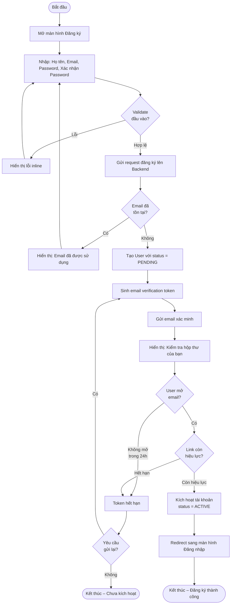

---

## 7.2 Activity Diagram – AI Sinh Lịch Trình Tự Động

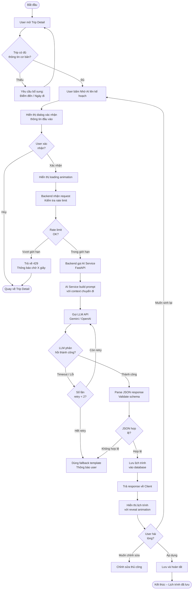

---

## 7.3 Activity Diagram – Quản lý Chi phí Nhóm & Chia tiền

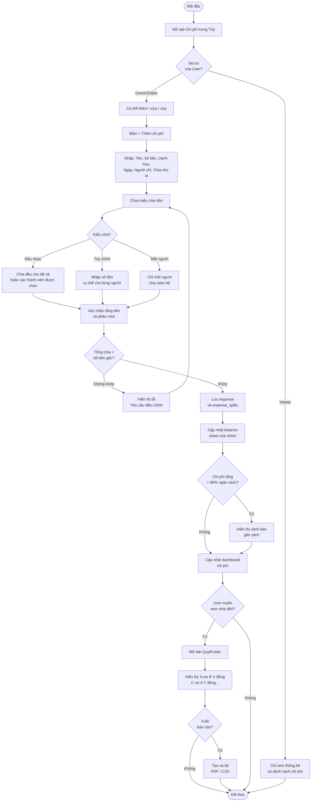

---

## 7.4 Activity Diagram – Mời Thành viên & Phân quyền

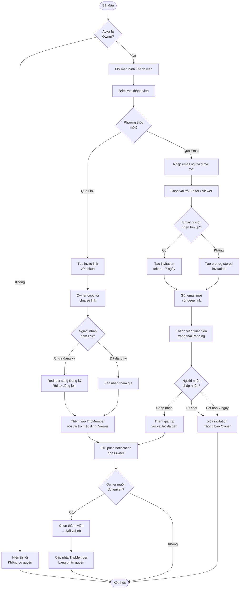

---

## 7.5 Activity Diagram – AI Chatbot Tư vấn Du lịch

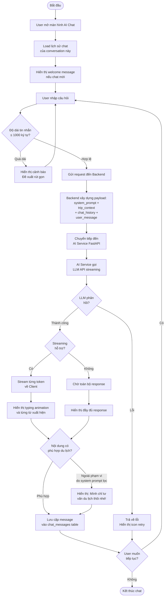

---

# PHẦN 8 – SEQUENCE DIAGRAM

> Sequence Diagram mô tả tương tác theo thời gian giữa các thành phần hệ thống.

## 8.1 Sequence Diagram – Đăng nhập với JWT

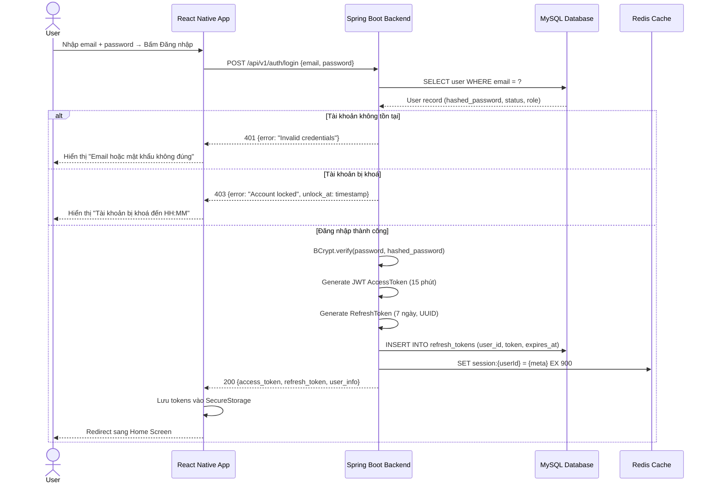

---

## 8.2 Sequence Diagram – Refresh Token khi Access Token hết hạn

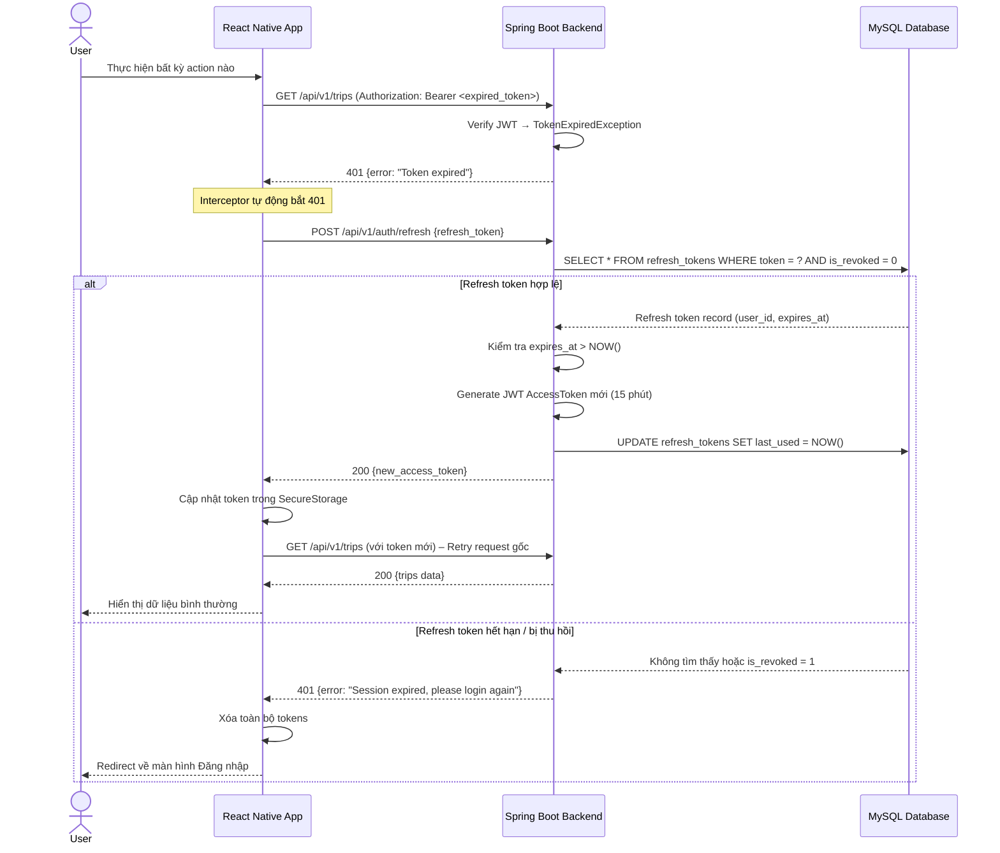

---

## 8.3 Sequence Diagram – AI Sinh Lịch Trình (End-to-End)

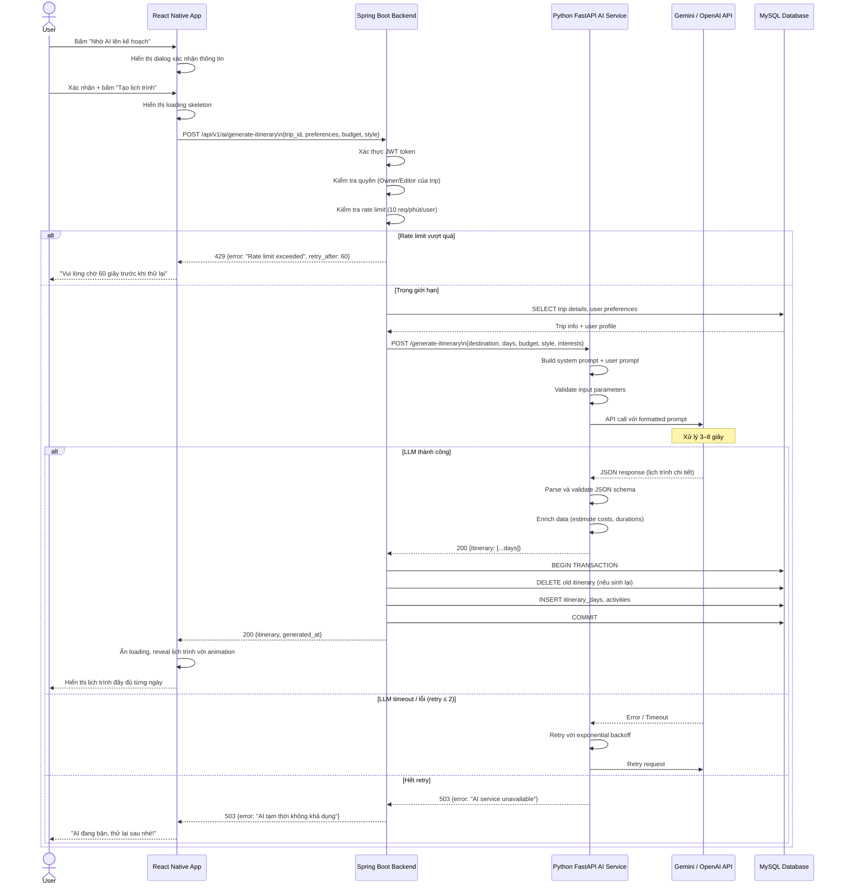

---

## 8.4 Sequence Diagram – Mời thành viên qua Email

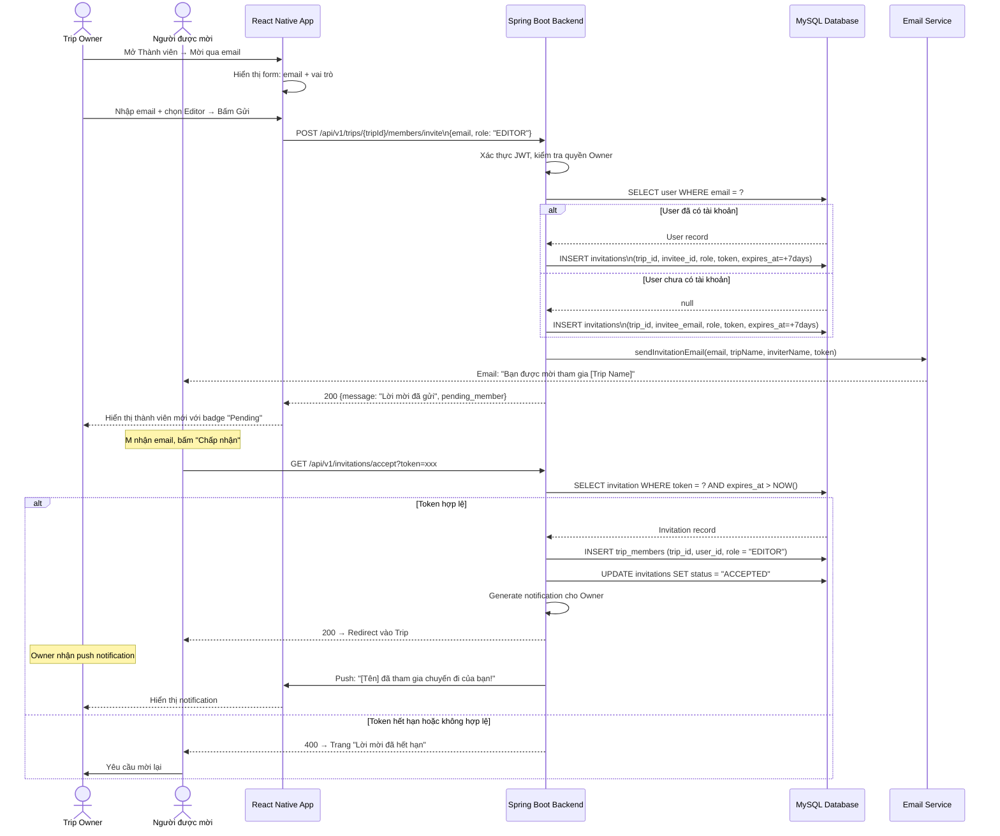

---

# PHẦN 9 – KIẾN TRÚC HỆ THỐNG

## 9.1 Tổng quan kiến trúc (Architecture Overview)

TravelMate AI sử dụng kiến trúc **Client–Server** với 3 tầng chính, kết hợp dịch vụ AI riêng biệt:

```
┌─────────────────────────────────────────────────────────────────────┐
│                         CLIENT TIER                                  │
│  ┌──────────────────────────────────────────────────────────────┐   │
│  │              React Native App (Expo)                         │   │
│  │   iOS Device          Android Device          Tablet         │   │
│  └──────────────────────────────────────────────────────────────┘   │
└────────────────────────────┬────────────────────────────────────────┘
                             │ HTTPS / REST API / JWT
                             │
┌────────────────────────────▼────────────────────────────────────────┐
│                        SERVER TIER                                   │
│  ┌─────────────────────────────────────────────────────────────┐    │
│  │               Spring Boot Backend (Java 21)                 │    │
│  │  ┌──────────┐  ┌──────────┐  ┌──────────┐  ┌──────────┐   │    │
│  │  │Auth/JWT  │  │Trip Mgmt │  │Itinerary │  │Expense   │   │    │
│  │  │Controller│  │Service   │  │Service   │  │Service   │   │    │
│  │  └──────────┘  └──────────┘  └──────────┘  └──────────┘   │    │
│  │  ┌──────────┐  ┌──────────┐  ┌──────────┐  ┌──────────┐   │    │
│  │  │Place     │  │Share/    │  │Admin     │  │AI Proxy  │   │    │
│  │  │Service   │  │Perm Svc  │  │Service   │  │Service   │   │    │
│  │  └──────────┘  └──────────┘  └──────────┘  └──────────┘   │    │
│  └─────────────────────────────────────────────────────────────┘    │
│                           │                │                         │
│              ┌────────────┘                └────────────┐            │
│              ▼                                          ▼            │
│  ┌─────────────────────┐              ┌──────────────────────┐       │
│  │    MySQL 8.x DB      │              │   Redis Cache         │      │
│  │  (Primary Database)  │              │  (Session, Rate Limit)│      │
│  └─────────────────────┘              └──────────────────────┘       │
└────────────────────────────┬────────────────────────────────────────┘
                             │ Internal HTTP (Docker network)
                             │
┌────────────────────────────▼────────────────────────────────────────┐
│                         AI SERVICE TIER                              │
│  ┌─────────────────────────────────────────────────────────────┐    │
│  │              Python FastAPI AI Service                       │    │
│  │  ┌──────────────┐  ┌──────────────┐  ┌──────────────────┐  │    │
│  │  │ /generate-   │  │ /chat        │  │ /suggest-places  │  │    │
│  │  │  itinerary   │  │              │  │ /optimize        │  │    │
│  │  └──────────────┘  └──────────────┘  └──────────────────┘  │    │
│  │              │                                               │    │
│  │     ┌────────▼──────────────────────────────┐              │    │
│  │     │      Prompt Builder & Context Manager  │              │    │
│  │     └────────────────────────────────────────┘              │    │
│  └─────────────────────┬───────────────────────────────────────┘    │
└───────────────────────┬┘                                            │
                        │                                              │
           ┌────────────▼──────────────┐                              │
           │   External AI APIs         │                              │
           │  ┌─────────┐ ┌──────────┐ │                              │
           │  │ Gemini  │ │ OpenAI   │ │                              │
           │  │  API    │ │  GPT-4o  │ │                              │
           │  └─────────┘ └──────────┘ │                              │
           └────────────────────────────┘
```

## 9.2 Component Diagram

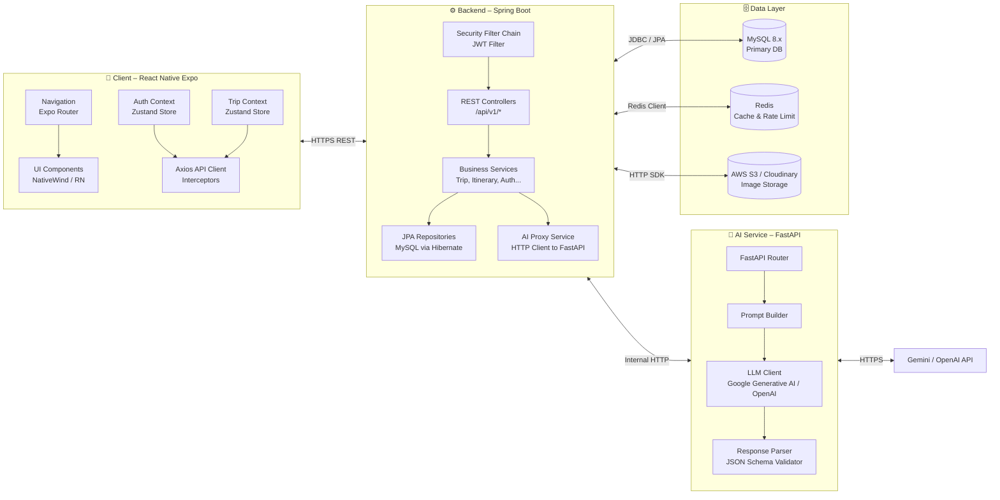

---

## 9.3 Deployment Diagram

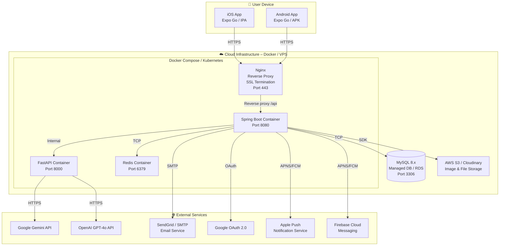

---

## 9.4 Layer Architecture

### 9.4.1 Spring Boot Backend – Clean Architecture

```
┌──────────────────────────────────────────────────┐
│                PRESENTATION LAYER                 │
│  REST Controllers → Request/Response DTOs         │
│  Exception Handlers → API Response Wrapper        │
├──────────────────────────────────────────────────┤
│                 SERVICE LAYER                     │
│  Business Logic → Validation → Orchestration      │
│  Transaction Management → Event Publishing        │
├──────────────────────────────────────────────────┤
│               REPOSITORY LAYER                    │
│  Spring Data JPA → Custom JPQL Queries            │
│  Repository Interfaces → Entity Mapping            │
├──────────────────────────────────────────────────┤
│                  DATA LAYER                       │
│  MySQL (JPA/Hibernate) │ Redis │ External APIs    │
└──────────────────────────────────────────────────┘

Cross-cutting Concerns:
  • Security: Spring Security + JWT Filter
  • Logging: SLF4J + Logback (JSON format)
  • Validation: Bean Validation (JSR-380)
  • Exception: GlobalExceptionHandler (@RestControllerAdvice)
  • Mapping: MapStruct (Entity ↔ DTO)
```

### 9.4.2 FastAPI AI Service – Layered Design

```
┌──────────────────────────────────────────────────┐
│                   ROUTER LAYER                    │
│  FastAPI Routers → Pydantic Request/Response      │
├──────────────────────────────────────────────────┤
│                  SERVICE LAYER                    │
│  ItineraryService │ ChatService │ PlaceService    │
├──────────────────────────────────────────────────┤
│               PROMPT ENGINE LAYER                 │
│  PromptBuilder → ContextManager → TemplateLoader  │
├──────────────────────────────────────────────────┤
│                  CLIENT LAYER                     │
│  GeminiClient │ OpenAIClient → Response Parser    │
├──────────────────────────────────────────────────┤
│                  SCHEMA LAYER                     │
│  JSON Schema Validator → Pydantic Models          │
└──────────────────────────────────────────────────┘
```

### 9.4.3 React Native App – Feature-based Structure

```
src/
├── app/                   # Expo Router screens
│   ├── (auth)/           # Login, Register, ForgotPassword
│   ├── (tabs)/           # Home, Trips, AI, Profile
│   └── trip/[id]/        # Trip Detail, Itinerary, Expense
├── components/           # Reusable UI components
│   ├── common/           # Button, Input, Card, Modal
│   ├── trip/             # TripCard, MemberList, ExpenseItem
│   └── ai/               # ChatBubble, ItineraryCard
├── services/             # API calls (axios instances)
│   ├── authService.ts
│   ├── tripService.ts
│   └── aiService.ts
├── stores/               # Zustand global state
│   ├── authStore.ts
│   └── tripStore.ts
├── hooks/                # Custom hooks
└── utils/                # Helpers, formatters, constants
```

---

## 9.5 Luồng xử lý Request tổng quát

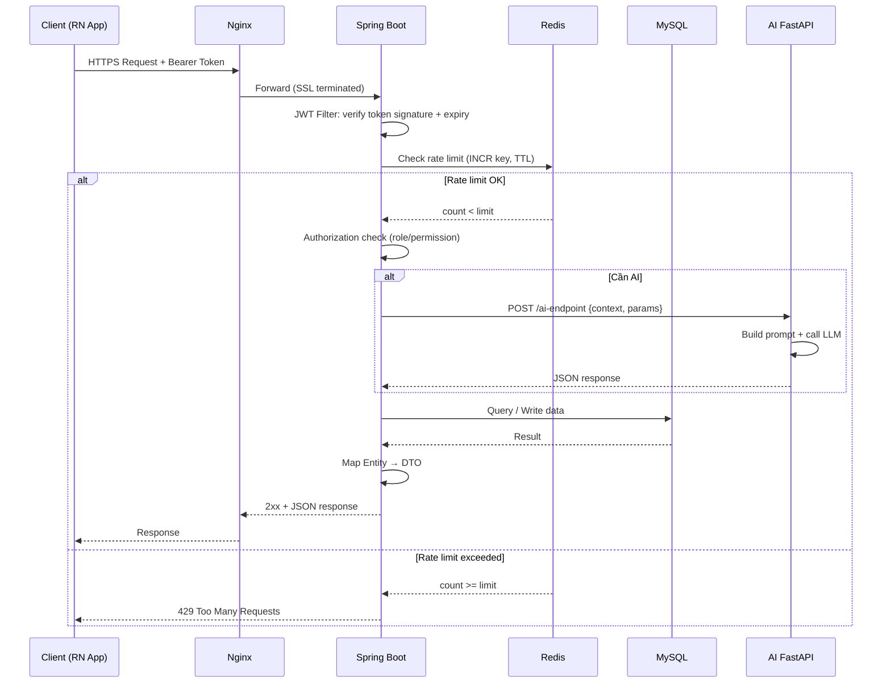

---

## 9.6 Chiến lược Bảo mật

| Lớp | Biện pháp | Công nghệ |
|-----|-----------|-----------|
| **Transport** | HTTPS/TLS 1.3 toàn bộ traffic | Nginx + Let's Encrypt |
| **Authentication** | JWT RS256, Access + Refresh token | Spring Security |
| **Authorization** | Role-based (ADMIN/USER) + Trip-level permission | Custom annotations |
| **Password** | BCrypt cost=12 | Spring Security |
| **Input** | Validation + Sanitization tất cả input | Bean Validation + OWASP ESAPI |
| **Rate Limiting** | 100 req/phút/IP, 10 AI req/phút/user | Redis + custom filter |
| **SQL Injection** | Parameterized queries qua JPA | Hibernate |
| **CORS** | Whitelist chính xác origins | Spring Security CORS config |
| **Secrets** | Biến môi trường, không hardcode | Docker secrets / .env |
| **Logging** | Audit log cho mọi thao tác nhạy cảm | SLF4J + AOP |

---

## 9.7 Chiến lược AI Integration

| Pattern | Mô tả | Áp dụng |
|---------|-------|---------|
| **Proxy Pattern** | Backend làm trung gian giữa Client và AI Service | Bảo vệ AI API key, kiểm soát rate limit |
| **Retry + Backoff** | Tự động retry 2 lần với delay 1s, 3s | Tăng resilience khi LLM timeout |
| **Fallback** | Template lịch trình mẫu khi AI down | Đảm bảo UX không bị gián đoạn hoàn toàn |
| **Async Processing** | Queue request AI nếu > 5s (future) | Tăng throughput, không block UI |
| **Context Injection** | Inject thông tin trip vào mỗi AI request | AI biết ngữ cảnh cụ thể của từng user |
| **Output Validation** | Validate JSON schema trước khi lưu DB | Tránh corrupt data từ LLM hallucination |

---

> **📌 Kết thúc Phần 3** – Bao gồm: Activity Diagram (5 luồng), Sequence Diagram (4 luồng), Kiến trúc hệ thống đầy đủ (Architecture Overview, Component, Deployment, Layer, Security, AI Integration).
>
> Gõ **"Tiếp tục"** để nhận **Phần 4**: Thiết kế CSDL (ERD, Data Dictionary) · Thiết kế API RESTful.
