# TravelMate AI – Tài liệu Phân tích & Thiết kế Hệ thống
## Phần 4: Class Diagram · Data Dictionary · Thiết kế API RESTful

> **Phiên bản:** 1.0 | **Ngày:** 2026-07-26

---

# PHẦN 9 – THIẾT KẾ CLASS DIAGRAM

## 9.1 Class Diagram – Toàn hệ thống

> **Ghi chú:** Diagram dưới đây thể hiện các domain class chính, quan hệ và một số method tiêu biểu.

```mermaid
classDiagram
    %% ─────────────── USER DOMAIN ───────────────
    class User {
        +Long id
        +String fullName
        +String email
        +String passwordHash
        +String avatarUrl
        +UserRole role
        +AccountStatus status
        +String googleId
        +LocalDateTime createdAt
        +LocalDateTime updatedAt
        +register(email, password) User
        +updateProfile(dto) void
        +changePassword(old, new) void
        +deactivate() void
    }

    class UserPreference {
        +Long id
        +Long userId
        +TravelStyle travelStyle
        +List~String~ interests
        +String preferredLanguage
        +Integer budgetRange
        +update(dto) void
    }

    class RefreshToken {
        +Long id
        +Long userId
        +String token
        +LocalDateTime expiresAt
        +Boolean isRevoked
        +LocalDateTime createdAt
        +revoke() void
        +isExpired() Boolean
    }

    class Invitation {
        +Long id
        +Long tripId
        +Long inviterId
        +String inviteeEmail
        +Long inviteeId
        +TripRole role
        +InvitationStatus status
        +String token
        +LocalDateTime expiresAt
        +accept() void
        +decline() void
        +isExpired() Boolean
    }

    %% ─────────────── TRIP DOMAIN ───────────────
    class Trip {
        +Long id
        +String name
        +String destination
        +String coverImageUrl
        +LocalDate startDate
        +LocalDate endDate
        +BigDecimal budget
        +Integer numPeople
        +TravelStyle style
        +String description
        +TripStatus status
        +Long ownerId
        +LocalDateTime createdAt
        +LocalDateTime updatedAt
        +getDurationDays() Integer
        +isOngoing() Boolean
        +isUpcoming() Boolean
        +computeBudgetUsed() BigDecimal
    }

    class TripMember {
        +Long id
        +Long tripId
        +Long userId
        +TripRole role
        +LocalDateTime joinedAt
        +canEdit() Boolean
        +canView() Boolean
        +isOwner() Boolean
    }

    class ItineraryDay {
        +Long id
        +Long tripId
        +Integer dayNumber
        +LocalDate date
        +String note
        +getTotalActivities() Integer
        +getEstimatedCost() BigDecimal
    }

    class Activity {
        +Long id
        +Long itineraryDayId
        +Long placeId
        +String name
        +String description
        +LocalTime startTime
        +LocalTime endTime
        +Integer sortOrder
        +ActivityType type
        +BigDecimal estimatedCost
        +ActivityStatus status
        +String note
        +String imageUrl
        +getDuration() Duration
        +markAsDone() void
        +markAsSkipped() void
    }

    class Place {
        +Long id
        +String name
        +String address
        +String city
        +String country
        +Double latitude
        +Double longitude
        +PlaceType type
        +Double rating
        +String phoneNumber
        +String website
        +String openingHours
        +String imageUrl
        +String priceRange
        +Boolean isUserGenerated
        +Long createdBy
        +getGoogleMapsUrl() String
    }

    class PlaceReview {
        +Long id
        +Long placeId
        +Long userId
        +Integer rating
        +String comment
        +LocalDateTime createdAt
        +LocalDateTime updatedAt
    }

    class SavedPlace {
        +Long id
        +Long tripId
        +Long placeId
        +Long savedBy
        +LocalDateTime savedAt
    }

    %% ─────────────── EXPENSE DOMAIN ───────────────
    class Expense {
        +Long id
        +Long tripId
        +String name
        +BigDecimal amount
        +ExpenseCategory category
        +LocalDate expenseDate
        +Long paidBy
        +String note
        +LocalDateTime createdAt
        +splitEqually(memberIds) List~ExpenseSplit~
        +splitCustom(splits) List~ExpenseSplit~
    }

    class ExpenseSplit {
        +Long id
        +Long expenseId
        +Long userId
        +BigDecimal amount
        +Boolean isSettled
        +LocalDateTime settledAt
        +settle() void
    }

    %% ─────────────── AI DOMAIN ───────────────
    class ChatConversation {
        +Long id
        +Long userId
        +Long tripId
        +String title
        +LocalDateTime createdAt
        +LocalDateTime lastMessageAt
        +getRecentMessages(n) List~ChatMessage~
    }

    class ChatMessage {
        +Long id
        +Long conversationId
        +MessageRole role
        +String content
        +LocalDateTime createdAt
        +Integer tokenCount
    }

    class AIGenerationLog {
        +Long id
        +Long userId
        +Long tripId
        +AIFeatureType featureType
        +String promptSummary
        +Integer inputTokens
        +Integer outputTokens
        +Long durationMs
        +Boolean isSuccess
        +String errorMessage
        +LocalDateTime createdAt
    }

    %% ─────────────── ENUMS ───────────────
    class UserRole {
        <<enumeration>>
        ADMIN
        USER
    }

    class TripRole {
        <<enumeration>>
        OWNER
        EDITOR
        VIEWER
    }

    class TripStatus {
        <<enumeration>>
        UPCOMING
        ONGOING
        COMPLETED
        CANCELLED
    }

    class ActivityType {
        <<enumeration>>
        SIGHTSEEING
        FOOD
        ACCOMMODATION
        TRANSPORT
        SHOPPING
        ENTERTAINMENT
        OTHER
    }

    class ActivityStatus {
        <<enumeration>>
        PLANNED
        DONE
        SKIPPED
    }

    class ExpenseCategory {
        <<enumeration>>
        FOOD
        TRANSPORT
        ACCOMMODATION
        ENTERTAINMENT
        SHOPPING
        OTHER
    }

    class TravelStyle {
        <<enumeration>>
        ADVENTURE
        RELAXATION
        CULTURE
        FOOD_TOUR
        FAMILY
        BUDGET
    }

    class PlaceType {
        <<enumeration>>
        ATTRACTION
        RESTAURANT
        HOTEL
        CAFE
        SHOPPING
        TRANSPORT_HUB
        OTHER
    }

    class MessageRole {
        <<enumeration>>
        USER
        ASSISTANT
        SYSTEM
    }

    class AIFeatureType {
        <<enumeration>>
        GENERATE_ITINERARY
        CHAT
        SUGGEST_PLACES
        OPTIMIZE_ITINERARY
    }

    class AccountStatus {
        <<enumeration>>
        PENDING
        ACTIVE
        LOCKED
        DELETED
    }

    class InvitationStatus {
        <<enumeration>>
        PENDING
        ACCEPTED
        DECLINED
        EXPIRED
    }

    %% ─────────────── RELATIONSHIPS ───────────────
    User "1" --> "0..1" UserPreference : has
    User "1" --> "0..*" RefreshToken : owns
    User "1" --> "0..*" Trip : creates
    User "1" --> "0..*" TripMember : participates
    User "1" --> "0..*" Expense : pays
    User "1" --> "0..*" ExpenseSplit : owes
    User "1" --> "0..*" ChatConversation : starts
    User "1" --> "0..*" PlaceReview : writes
    User "1" --> "0..*" AIGenerationLog : generates

    Trip "1" *-- "2..*" TripMember : has members
    Trip "1" *-- "1..*" ItineraryDay : contains
    Trip "1" *-- "0..*" Expense : tracks
    Trip "1" *-- "0..*" SavedPlace : saves
    Trip "1" *-- "0..*" Invitation : invites
    Trip "1" *-- "0..*" ChatConversation : context

    ItineraryDay "1" *-- "0..*" Activity : schedules

    Activity "0..*" --> "0..1" Place : references

    Place "1" --> "0..*" PlaceReview : receives
    Place "1" --> "0..*" SavedPlace : saved in

    Expense "1" *-- "1..*" ExpenseSplit : splits into

    ChatConversation "1" *-- "0..*" ChatMessage : contains

    User --> UserRole : has
    TripMember --> TripRole : assigned
    Trip --> TripStatus : has
    Activity --> ActivityType : typed as
    Activity --> ActivityStatus : has
    Expense --> ExpenseCategory : categorized
    User --> AccountStatus : has
    Invitation --> InvitationStatus : has
    Place --> PlaceType : typed as
    ChatMessage --> MessageRole : role
    AIGenerationLog --> AIFeatureType : type
    User --> TravelStyle : prefers
```



---

## 9.2 Mô tả các Class chính

| Class | Package | Trách nhiệm |
|-------|---------|-------------|
| `User` | `domain.user` | Entity người dùng, xác thực, profile |
| `UserPreference` | `domain.user` | Sở thích du lịch cá nhân hóa |
| `RefreshToken` | `domain.auth` | Quản lý vòng đời refresh token |
| `Invitation` | `domain.trip` | Lời mời tham gia chuyến đi |
| `Trip` | `domain.trip` | Aggregate root của chuyến đi |
| `TripMember` | `domain.trip` | Quan hệ User ↔ Trip với vai trò |
| `ItineraryDay` | `domain.itinerary` | Một ngày trong lịch trình |
| `Activity` | `domain.itinerary` | Một hoạt động cụ thể trong ngày |
| `Place` | `domain.place` | Địa điểm (nhà hàng, điểm tham quan...) |
| `PlaceReview` | `domain.place` | Đánh giá địa điểm của user |
| `SavedPlace` | `domain.place` | Danh sách địa điểm yêu thích của trip |
| `Expense` | `domain.expense` | Chi phí phát sinh trong chuyến đi |
| `ExpenseSplit` | `domain.expense` | Chi tiết phân chia chi phí |
| `ChatConversation` | `domain.ai` | Phiên trò chuyện với AI chatbot |
| `ChatMessage` | `domain.ai` | Từng tin nhắn trong cuộc trò chuyện |
| `AIGenerationLog` | `domain.ai` | Log mọi request gọi AI (audit, billing) |

---

# PHẦN 10 – DATA DICTIONARY

> Mô tả chi tiết các bảng trong MySQL Database tương ứng với từng class.

## 10.1 Bảng `users`

| Column | Type | Constraint | Mô tả |
|--------|------|-----------|-------|
| `id` | BIGINT | PK, AUTO_INCREMENT | Khóa chính |
| `full_name` | VARCHAR(100) | NOT NULL | Họ và tên đầy đủ |
| `email` | VARCHAR(255) | NOT NULL, UNIQUE | Email đăng nhập |
| `password_hash` | VARCHAR(255) | NULL | BCrypt hash (null nếu OAuth) |
| `avatar_url` | VARCHAR(500) | NULL | URL ảnh đại diện |
| `role` | ENUM('ADMIN','USER') | NOT NULL, DEFAULT 'USER' | Vai trò hệ thống |
| `status` | ENUM('PENDING','ACTIVE','LOCKED','DELETED') | NOT NULL, DEFAULT 'PENDING' | Trạng thái tài khoản |
| `google_id` | VARCHAR(255) | NULL, UNIQUE | Google OAuth ID |
| `email_verified_at` | DATETIME | NULL | Thời điểm xác minh email |
| `failed_login_attempts` | INT | NOT NULL, DEFAULT 0 | Số lần đăng nhập sai |
| `locked_until` | DATETIME | NULL | Khoá đến khi nào |
| `created_at` | DATETIME | NOT NULL, DEFAULT NOW() | Ngày tạo |
| `updated_at` | DATETIME | NOT NULL | Ngày cập nhật |
| `deleted_at` | DATETIME | NULL | Soft delete timestamp |

**Index:** `idx_users_email` (email), `idx_users_google_id` (google_id)

---

## 10.2 Bảng `user_preferences`

| Column | Type | Constraint | Mô tả |
|--------|------|-----------|-------|
| `id` | BIGINT | PK, AUTO_INCREMENT | Khóa chính |
| `user_id` | BIGINT | FK → users.id, UNIQUE | Liên kết user (1-1) |
| `travel_style` | ENUM | NULL | Phong cách du lịch ưa thích |
| `interests` | JSON | NULL | Danh sách sở thích (mảng string) |
| `preferred_language` | VARCHAR(10) | DEFAULT 'vi' | Ngôn ngữ ưa thích |
| `budget_range` | INT | NULL | Ngân sách thông thường (VND/ngày) |
| `updated_at` | DATETIME | NOT NULL | Lần cập nhật gần nhất |

---

## 10.3 Bảng `refresh_tokens`

| Column | Type | Constraint | Mô tả |
|--------|------|-----------|-------|
| `id` | BIGINT | PK, AUTO_INCREMENT | Khóa chính |
| `user_id` | BIGINT | FK → users.id | Chủ sở hữu token |
| `token` | VARCHAR(512) | NOT NULL, UNIQUE | UUID token string |
| `expires_at` | DATETIME | NOT NULL | Thời điểm hết hạn |
| `is_revoked` | TINYINT(1) | NOT NULL, DEFAULT 0 | Đã bị thu hồi chưa |
| `device_info` | VARCHAR(255) | NULL | Thông tin thiết bị |
| `created_at` | DATETIME | NOT NULL | Thời điểm tạo |
| `last_used_at` | DATETIME | NULL | Lần dùng gần nhất |

**Index:** `idx_refresh_tokens_token` (token), `idx_refresh_tokens_user_id` (user_id)

---

## 10.4 Bảng `trips`

| Column | Type | Constraint | Mô tả |
|--------|------|-----------|-------|
| `id` | BIGINT | PK, AUTO_INCREMENT | Khóa chính |
| `name` | VARCHAR(100) | NOT NULL | Tên chuyến đi |
| `destination` | VARCHAR(255) | NOT NULL | Điểm đến chính |
| `cover_image_url` | VARCHAR(500) | NULL | Ảnh bìa chuyến đi |
| `start_date` | DATE | NOT NULL | Ngày bắt đầu |
| `end_date` | DATE | NOT NULL | Ngày kết thúc |
| `budget` | DECIMAL(15,2) | NULL | Ngân sách dự kiến (VND) |
| `num_people` | INT | NOT NULL, DEFAULT 1 | Số người tham gia |
| `travel_style` | ENUM | NULL | Phong cách chuyến đi |
| `description` | TEXT | NULL | Mô tả chuyến đi |
| `status` | ENUM('UPCOMING','ONGOING','COMPLETED','CANCELLED') | NOT NULL | Trạng thái |
| `owner_id` | BIGINT | FK → users.id | Chủ sở hữu |
| `is_public` | TINYINT(1) | NOT NULL, DEFAULT 0 | Có chia sẻ công khai không |
| `public_token` | VARCHAR(64) | NULL, UNIQUE | Token link chia sẻ công khai |
| `created_at` | DATETIME | NOT NULL | Ngày tạo |
| `updated_at` | DATETIME | NOT NULL | Ngày cập nhật |

**Index:** `idx_trips_owner_id` (owner_id), `idx_trips_status` (status), `idx_trips_destination` (destination)

---

## 10.5 Bảng `trip_members`

| Column | Type | Constraint | Mô tả |
|--------|------|-----------|-------|
| `id` | BIGINT | PK, AUTO_INCREMENT | Khóa chính |
| `trip_id` | BIGINT | FK → trips.id | Chuyến đi |
| `user_id` | BIGINT | FK → users.id | Thành viên |
| `role` | ENUM('OWNER','EDITOR','VIEWER') | NOT NULL | Vai trò trong trip |
| `joined_at` | DATETIME | NOT NULL | Ngày tham gia |

**Unique:** `(trip_id, user_id)` | **Index:** `idx_trip_members_trip_id`, `idx_trip_members_user_id`

---

## 10.6 Bảng `itinerary_days`

| Column | Type | Constraint | Mô tả |
|--------|------|-----------|-------|
| `id` | BIGINT | PK, AUTO_INCREMENT | Khóa chính |
| `trip_id` | BIGINT | FK → trips.id, ON DELETE CASCADE | Thuộc chuyến đi nào |
| `day_number` | INT | NOT NULL | Ngày thứ mấy (1, 2, 3...) |
| `date` | DATE | NOT NULL | Ngày cụ thể |
| `note` | TEXT | NULL | Ghi chú tổng quan cho ngày |

**Unique:** `(trip_id, day_number)` | **Index:** `idx_itinerary_days_trip_id`

---

## 10.7 Bảng `activities`

| Column | Type | Constraint | Mô tả |
|--------|------|-----------|-------|
| `id` | BIGINT | PK, AUTO_INCREMENT | Khóa chính |
| `itinerary_day_id` | BIGINT | FK → itinerary_days.id, ON DELETE CASCADE | Thuộc ngày nào |
| `place_id` | BIGINT | FK → places.id, NULL | Địa điểm liên kết (có thể null) |
| `name` | VARCHAR(255) | NOT NULL | Tên hoạt động |
| `description` | TEXT | NULL | Mô tả chi tiết |
| `start_time` | TIME | NULL | Giờ bắt đầu |
| `end_time` | TIME | NULL | Giờ kết thúc |
| `sort_order` | INT | NOT NULL, DEFAULT 0 | Thứ tự trong ngày |
| `type` | ENUM | NOT NULL, DEFAULT 'OTHER' | Loại hoạt động |
| `estimated_cost` | DECIMAL(12,2) | NULL | Chi phí ước tính |
| `status` | ENUM('PLANNED','DONE','SKIPPED') | NOT NULL, DEFAULT 'PLANNED' | Trạng thái |
| `note` | TEXT | NULL | Ghi chú cá nhân |
| `image_url` | VARCHAR(500) | NULL | Ảnh minh họa |
| `created_at` | DATETIME | NOT NULL | Ngày tạo |
| `updated_at` | DATETIME | NOT NULL | Ngày cập nhật |

**Index:** `idx_activities_itinerary_day_id`, `idx_activities_sort_order`

---

## 10.8 Bảng `places`

| Column | Type | Constraint | Mô tả |
|--------|------|-----------|-------|
| `id` | BIGINT | PK, AUTO_INCREMENT | Khóa chính |
| `name` | VARCHAR(255) | NOT NULL | Tên địa điểm |
| `address` | VARCHAR(500) | NULL | Địa chỉ đầy đủ |
| `city` | VARCHAR(100) | NOT NULL | Thành phố |
| `country` | VARCHAR(100) | NOT NULL, DEFAULT 'Vietnam' | Quốc gia |
| `latitude` | DECIMAL(10,8) | NULL | Tọa độ vĩ độ |
| `longitude` | DECIMAL(11,8) | NULL | Tọa độ kinh độ |
| `type` | ENUM | NOT NULL | Loại địa điểm |
| `rating` | DECIMAL(2,1) | NULL | Rating trung bình (1.0–5.0) |
| `phone_number` | VARCHAR(20) | NULL | Số điện thoại |
| `website` | VARCHAR(500) | NULL | Website |
| `opening_hours` | JSON | NULL | Giờ mở cửa theo ngày |
| `image_url` | VARCHAR(500) | NULL | Ảnh đại diện |
| `price_range` | VARCHAR(10) | NULL | $, $$, $$$, $$$$ |
| `is_user_generated` | TINYINT(1) | NOT NULL, DEFAULT 0 | Do user tạo hay từ hệ thống |
| `created_by` | BIGINT | FK → users.id, NULL | Người tạo (nếu user generated) |
| `created_at` | DATETIME | NOT NULL | Ngày tạo |

**Index:** `idx_places_city`, `idx_places_type`, `FULLTEXT idx_places_name` (name)

---

## 10.9 Bảng `expenses`

| Column | Type | Constraint | Mô tả |
|--------|------|-----------|-------|
| `id` | BIGINT | PK, AUTO_INCREMENT | Khóa chính |
| `trip_id` | BIGINT | FK → trips.id, ON DELETE CASCADE | Thuộc chuyến đi |
| `name` | VARCHAR(255) | NOT NULL | Tên khoản chi |
| `amount` | DECIMAL(15,2) | NOT NULL | Số tiền (VND) |
| `category` | ENUM | NOT NULL | Danh mục chi phí |
| `expense_date` | DATE | NOT NULL | Ngày phát sinh |
| `paid_by` | BIGINT | FK → users.id | Người chi trả |
| `note` | TEXT | NULL | Ghi chú thêm |
| `created_at` | DATETIME | NOT NULL | Ngày ghi nhận |

**Index:** `idx_expenses_trip_id`, `idx_expenses_paid_by`, `idx_expenses_category`

---

## 10.10 Bảng `expense_splits`

| Column | Type | Constraint | Mô tả |
|--------|------|-----------|-------|
| `id` | BIGINT | PK, AUTO_INCREMENT | Khóa chính |
| `expense_id` | BIGINT | FK → expenses.id, ON DELETE CASCADE | Thuộc khoản chi nào |
| `user_id` | BIGINT | FK → users.id | Người phải trả |
| `amount` | DECIMAL(15,2) | NOT NULL | Số tiền phải trả |
| `is_settled` | TINYINT(1) | NOT NULL, DEFAULT 0 | Đã thanh toán chưa |
| `settled_at` | DATETIME | NULL | Thời điểm thanh toán |

**Unique:** `(expense_id, user_id)`

---

## 10.11 Bảng `chat_conversations` & `chat_messages`

**`chat_conversations`**

| Column | Type | Constraint | Mô tả |
|--------|------|-----------|-------|
| `id` | BIGINT | PK | Khóa chính |
| `user_id` | BIGINT | FK → users.id | Chủ cuộc trò chuyện |
| `trip_id` | BIGINT | FK → trips.id, NULL | Trip context (nếu có) |
| `title` | VARCHAR(255) | NULL | Tiêu đề tự sinh |
| `created_at` | DATETIME | NOT NULL | Thời điểm tạo |
| `last_message_at` | DATETIME | NULL | Tin nhắn cuối |

**`chat_messages`**

| Column | Type | Constraint | Mô tả |
|--------|------|-----------|-------|
| `id` | BIGINT | PK | Khóa chính |
| `conversation_id` | BIGINT | FK → chat_conversations.id | Thuộc conversation |
| `role` | ENUM('USER','ASSISTANT','SYSTEM') | NOT NULL | Người gửi |
| `content` | TEXT | NOT NULL | Nội dung tin nhắn |
| `token_count` | INT | NULL | Số token tiêu thụ |
| `created_at` | DATETIME | NOT NULL | Thời điểm gửi |

---

## 10.12 Bảng `ai_generation_logs`

| Column | Type | Constraint | Mô tả |
|--------|------|-----------|-------|
| `id` | BIGINT | PK | Khóa chính |
| `user_id` | BIGINT | FK → users.id | Người dùng |
| `trip_id` | BIGINT | FK → trips.id, NULL | Trip liên quan |
| `feature_type` | ENUM | NOT NULL | Loại tính năng AI |
| `prompt_summary` | VARCHAR(500) | NULL | Tóm tắt prompt |
| `input_tokens` | INT | NULL | Token đầu vào |
| `output_tokens` | INT | NULL | Token đầu ra |
| `duration_ms` | BIGINT | NULL | Thời gian xử lý (ms) |
| `is_success` | TINYINT(1) | NOT NULL | Thành công hay không |
| `error_message` | TEXT | NULL | Thông báo lỗi nếu thất bại |
| `created_at` | DATETIME | NOT NULL | Thời điểm gọi |

---

# PHẦN 11 – THIẾT KẾ API RESTful

## 11.0 Quy ước chung

### Base URL
```
Production : https://api.travelmate.ai/api/v1
Development: http://localhost:8080/api/v1
```

### Chuẩn Response Wrapper

**Success Response:**
```json
{
  "success": true,
  "data": { ... },
  "message": "Thao tác thành công",
  "timestamp": "2026-07-26T10:00:00Z"
}
```

**Paginated Response:**
```json
{
  "success": true,
  "data": {
    "items": [ ... ],
    "page": 1,
    "size": 10,
    "totalElements": 45,
    "totalPages": 5,
    "hasNext": true
  }
}
```

**Error Response:**
```json
{
  "success": false,
  "error": {
    "code": "TRIP_NOT_FOUND",
    "message": "Không tìm thấy chuyến đi",
    "details": null
  },
  "timestamp": "2026-07-26T10:00:00Z"
}
```

### HTTP Status Codes

| Code | Ý nghĩa |
|------|---------|
| 200 OK | Thành công |
| 201 Created | Tạo mới thành công |
| 204 No Content | Xóa thành công |
| 400 Bad Request | Dữ liệu đầu vào không hợp lệ |
| 401 Unauthorized | Chưa xác thực hoặc token hết hạn |
| 403 Forbidden | Không có quyền thực hiện |
| 404 Not Found | Tài nguyên không tồn tại |
| 409 Conflict | Xung đột dữ liệu (vd: email đã tồn tại) |
| 422 Unprocessable | Validate thất bại với chi tiết từng field |
| 429 Too Many Requests | Vượt rate limit |
| 500 Internal Server Error | Lỗi server |
| 503 Service Unavailable | AI service không khả dụng |

---

## 11.1 Module AUTH – Xác thực

| Method | Endpoint | Auth | Mô tả |
|--------|----------|------|-------|
| POST | `/auth/register` | ❌ | Đăng ký tài khoản |
| POST | `/auth/login` | ❌ | Đăng nhập |
| POST | `/auth/refresh` | ❌ | Làm mới access token |
| POST | `/auth/logout` | ✅ | Đăng xuất |
| POST | `/auth/google` | ❌ | Đăng nhập Google OAuth |
| POST | `/auth/forgot-password` | ❌ | Yêu cầu OTP đặt lại mật khẩu |
| POST | `/auth/reset-password` | ❌ | Đặt lại mật khẩu bằng OTP |
| GET | `/auth/verify-email` | ❌ | Xác minh email qua token |
| POST | `/auth/resend-verification` | ❌ | Gửi lại email xác minh |

### POST `/auth/register`
```json
// Request Body
{
  "fullName": "Nguyễn Văn A",
  "email": "nguyenvana@gmail.com",
  "password": "SecurePass123",
  "confirmPassword": "SecurePass123"
}

// Response 201
{
  "success": true,
  "data": {
    "message": "Đăng ký thành công. Vui lòng kiểm tra email để xác minh tài khoản."
  }
}
```

### POST `/auth/login`
```json
// Request Body
{
  "email": "nguyenvana@gmail.com",
  "password": "SecurePass123"
}

// Response 200
{
  "success": true,
  "data": {
    "accessToken": "eyJhbGciOiJSUzI1NiJ9...",
    "refreshToken": "550e8400-e29b-41d4-a716-446655440000",
    "tokenType": "Bearer",
    "expiresIn": 900,
    "user": {
      "id": 1,
      "fullName": "Nguyễn Văn A",
      "email": "nguyenvana@gmail.com",
      "avatarUrl": null,
      "role": "USER"
    }
  }
}
```

### POST `/auth/refresh`
```json
// Request Body
{ "refreshToken": "550e8400-e29b-41d4-a716-446655440000" }

// Response 200
{
  "success": true,
  "data": {
    "accessToken": "eyJhbGciOiJSUzI1NiJ9...(mới)",
    "expiresIn": 900
  }
}
```

---

## 11.2 Module USER – Người dùng

| Method | Endpoint | Auth | Mô tả |
|--------|----------|------|-------|
| GET | `/users/me` | ✅ | Lấy thông tin bản thân |
| PUT | `/users/me` | ✅ | Cập nhật profile |
| PUT | `/users/me/password` | ✅ | Đổi mật khẩu |
| PUT | `/users/me/avatar` | ✅ | Upload ảnh đại diện |
| GET | `/users/me/preferences` | ✅ | Lấy sở thích du lịch |
| PUT | `/users/me/preferences` | ✅ | Cập nhật sở thích |
| DELETE | `/users/me` | ✅ | Xóa tài khoản (soft delete) |

### GET `/users/me` – Response 200
```json
{
  "success": true,
  "data": {
    "id": 1,
    "fullName": "Nguyễn Văn A",
    "email": "nguyenvana@gmail.com",
    "avatarUrl": "https://cdn.travelmate.ai/avatars/1.jpg",
    "role": "USER",
    "status": "ACTIVE",
    "createdAt": "2026-01-15T08:00:00Z",
    "preferences": {
      "travelStyle": "ADVENTURE",
      "interests": ["hiking", "local_food", "photography"],
      "preferredLanguage": "vi",
      "budgetRange": 500000
    }
  }
}
```

---

## 11.3 Module TRIP – Chuyến đi

| Method | Endpoint | Auth | Mô tả |
|--------|----------|------|-------|
| GET | `/trips` | ✅ | Danh sách trip của user (phân trang) |
| POST | `/trips` | ✅ | Tạo trip mới |
| GET | `/trips/{tripId}` | ✅ | Chi tiết một trip |
| PUT | `/trips/{tripId}` | ✅ Owner/Editor | Cập nhật trip |
| DELETE | `/trips/{tripId}` | ✅ Owner | Xóa trip |
| POST | `/trips/{tripId}/duplicate` | ✅ | Nhân bản trip |
| GET | `/trips/public/{publicToken}` | ❌ | Xem trip công khai |
| PUT | `/trips/{tripId}/cover` | ✅ Owner | Upload ảnh bìa |

### GET `/trips?status=UPCOMING&page=1&size=10`
```json
{
  "success": true,
  "data": {
    "items": [
      {
        "id": 42,
        "name": "Đà Lạt 5N4Đ",
        "destination": "Đà Lạt, Lâm Đồng",
        "coverImageUrl": "https://cdn.travelmate.ai/trips/42.jpg",
        "startDate": "2026-08-10",
        "endDate": "2026-08-14",
        "budget": 5000000,
        "numPeople": 4,
        "status": "UPCOMING",
        "myRole": "OWNER",
        "memberCount": 4,
        "durationDays": 5
      }
    ],
    "page": 1, "size": 10,
    "totalElements": 3, "totalPages": 1
  }
}
```

### POST `/trips` – Request Body
```json
{
  "name": "Đà Lạt 5N4Đ",
  "destination": "Đà Lạt, Lâm Đồng",
  "startDate": "2026-08-10",
  "endDate": "2026-08-14",
  "budget": 5000000,
  "numPeople": 4,
  "travelStyle": "RELAXATION",
  "description": "Chuyến đi hè cùng hội bạn thân"
}
// Response 201: { "success": true, "data": { trip object } }
```

---

## 11.4 Module ITINERARY – Lịch trình

| Method | Endpoint | Auth | Mô tả |
|--------|----------|------|-------|
| GET | `/trips/{tripId}/itinerary` | ✅ Member | Lấy toàn bộ lịch trình |
| GET | `/trips/{tripId}/itinerary/days/{dayId}` | ✅ Member | Chi tiết một ngày |
| PUT | `/trips/{tripId}/itinerary/days/{dayId}` | ✅ Owner/Editor | Cập nhật ghi chú ngày |
| POST | `/trips/{tripId}/itinerary/days/{dayId}/activities` | ✅ Owner/Editor | Thêm hoạt động |
| PUT | `/trips/{tripId}/itinerary/days/{dayId}/activities/{actId}` | ✅ Owner/Editor | Sửa hoạt động |
| DELETE | `/trips/{tripId}/itinerary/days/{dayId}/activities/{actId}` | ✅ Owner/Editor | Xóa hoạt động |
| PUT | `/trips/{tripId}/itinerary/days/{dayId}/activities/reorder` | ✅ Owner/Editor | Sắp xếp lại thứ tự |
| PATCH | `/trips/{tripId}/itinerary/days/{dayId}/activities/{actId}/status` | ✅ Owner/Editor | Đổi trạng thái |

### GET `/trips/42/itinerary` – Response 200
```json
{
  "success": true,
  "data": {
    "tripId": 42,
    "days": [
      {
        "id": 101,
        "dayNumber": 1,
        "date": "2026-08-10",
        "note": "Ngày đầu tiên – Di chuyển và nhận phòng",
        "activities": [
          {
            "id": 201,
            "name": "Bay từ SGN đến DLI",
            "type": "TRANSPORT",
            "startTime": "06:30",
            "endTime": "07:45",
            "sortOrder": 1,
            "status": "PLANNED",
            "estimatedCost": 1200000,
            "place": null
          },
          {
            "id": 202,
            "name": "Check-in khách sạn Đà Lạt Palace",
            "type": "ACCOMMODATION",
            "startTime": "14:00",
            "endTime": null,
            "sortOrder": 2,
            "status": "PLANNED",
            "estimatedCost": 800000,
            "place": {
              "id": 55,
              "name": "Đà Lạt Palace Heritage Hotel",
              "address": "12 Trần Phú, Đà Lạt",
              "type": "HOTEL",
              "rating": 4.5
            }
          }
        ]
      }
    ]
  }
}
```

### POST `.../activities` – Request Body
```json
{
  "name": "Thăm Hồ Xuân Hương",
  "type": "SIGHTSEEING",
  "placeId": 88,
  "startTime": "08:00",
  "endTime": "10:00",
  "estimatedCost": 0,
  "note": "Đi bộ buổi sáng quanh hồ",
  "sortOrder": 3
}
```

### PUT `.../activities/reorder` – Request Body
```json
{
  "orderedActivityIds": [202, 205, 201, 203, 204]
}
```

---

## 11.5 Module PLACE – Địa điểm

| Method | Endpoint | Auth | Mô tả |
|--------|----------|------|-------|
| GET | `/places/search` | ✅ | Tìm kiếm địa điểm |
| GET | `/places/{placeId}` | ✅ | Chi tiết địa điểm |
| POST | `/places` | ✅ | Tạo địa điểm do user đề xuất |
| GET | `/places/{placeId}/reviews` | ✅ | Danh sách review |
| POST | `/places/{placeId}/reviews` | ✅ | Viết review |
| GET | `/trips/{tripId}/saved-places` | ✅ Member | Địa điểm đã lưu trong trip |
| POST | `/trips/{tripId}/saved-places` | ✅ Owner/Editor | Lưu địa điểm vào trip |
| DELETE | `/trips/{tripId}/saved-places/{savedId}` | ✅ Owner/Editor | Xóa khỏi danh sách đã lưu |

### GET `/places/search?q=cà+phê&city=Đà+Lạt&type=CAFE&page=1&size=10`
```json
{
  "success": true,
  "data": {
    "items": [
      {
        "id": 301,
        "name": "The Married Beans",
        "address": "03 Tống Duy Tân, Đà Lạt",
        "city": "Đà Lạt",
        "type": "CAFE",
        "rating": 4.7,
        "priceRange": "$$",
        "imageUrl": "https://cdn.travelmate.ai/places/301.jpg",
        "latitude": 11.940419,
        "longitude": 108.458313
      }
    ],
    "totalElements": 28
  }
}
```

---

## 11.6 Module EXPENSE – Chi phí

| Method | Endpoint | Auth | Mô tả |
|--------|----------|------|-------|
| GET | `/trips/{tripId}/expenses` | ✅ Member | Danh sách chi phí |
| POST | `/trips/{tripId}/expenses` | ✅ Owner/Editor | Thêm chi phí |
| PUT | `/trips/{tripId}/expenses/{expId}` | ✅ Owner/Editor | Sửa chi phí |
| DELETE | `/trips/{tripId}/expenses/{expId}` | ✅ Owner/Editor | Xóa chi phí |
| GET | `/trips/{tripId}/expenses/summary` | ✅ Member | Tổng kết chi phí |
| GET | `/trips/{tripId}/expenses/balances` | ✅ Member | Bảng quyết toán (ai nợ ai) |
| PATCH | `/trips/{tripId}/expenses/splits/{splitId}/settle` | ✅ Owner/Editor | Đánh dấu đã thanh toán |
| GET | `/trips/{tripId}/expenses/export` | ✅ Member | Xuất PDF/CSV |

### POST `/trips/42/expenses` – Request Body
```json
{
  "name": "Bữa tối nhà hàng Thanh Thủy",
  "amount": 840000,
  "category": "FOOD",
  "expenseDate": "2026-08-10",
  "paidBy": 1,
  "note": "4 người ăn tối",
  "splitType": "EQUAL",
  "splitWith": [1, 2, 3, 4]
}
// splitType: EQUAL | CUSTOM | SINGLE
// Nếu CUSTOM: thêm "customSplits": [{"userId":1,"amount":200000}, ...]
```

### GET `/trips/42/expenses/balances` – Response 200
```json
{
  "success": true,
  "data": {
    "totalExpense": 12500000,
    "budget": 15000000,
    "budgetUsedPercent": 83.3,
    "balances": [
      { "from": { "id": 2, "name": "Minh" }, "to": { "id": 1, "name": "An" }, "amount": 1750000 },
      { "from": { "id": 3, "name": "Lan" }, "to": { "id": 1, "name": "An" }, "amount": 920000 },
      { "from": { "id": 4, "name": "Huy" }, "to": { "id": 2, "name": "Minh" }, "amount": 430000 }
    ]
  }
}
```

---

## 11.7 Module MEMBER – Thành viên & Phân quyền

| Method | Endpoint | Auth | Mô tả |
|--------|----------|------|-------|
| GET | `/trips/{tripId}/members` | ✅ Member | Danh sách thành viên |
| POST | `/trips/{tripId}/members/invite` | ✅ Owner | Mời qua email |
| POST | `/trips/{tripId}/members/invite-link` | ✅ Owner | Tạo link mời |
| GET | `/invitations/accept` | ❌ | Chấp nhận lời mời (qua token) |
| PUT | `/trips/{tripId}/members/{memberId}/role` | ✅ Owner | Đổi vai trò |
| DELETE | `/trips/{tripId}/members/{memberId}` | ✅ Owner | Xóa thành viên |
| DELETE | `/trips/{tripId}/members/me` | ✅ Editor/Viewer | Tự rời trip |

### POST `/trips/42/members/invite`
```json
// Request
{ "email": "friend@gmail.com", "role": "EDITOR" }

// Response 200
{
  "success": true,
  "data": {
    "invitationId": 15,
    "inviteeEmail": "friend@gmail.com",
    "role": "EDITOR",
    "status": "PENDING",
    "expiresAt": "2026-08-02T10:00:00Z"
  }
}
```

### PUT `/trips/42/members/7/role`
```json
// Request
{ "role": "VIEWER" }
// Response 200: { "success": true, "data": { updated member } }
```

---

## 11.8 Module AI – Tính năng AI

| Method | Endpoint | Auth | Rate Limit | Mô tả |
|--------|----------|------|------------|-------|
| POST | `/ai/generate-itinerary` | ✅ | 10/phút | AI sinh lịch trình |
| POST | `/ai/optimize-itinerary` | ✅ | 10/phút | AI tối ưu lịch trình |
| GET | `/ai/suggest-places` | ✅ | 20/phút | AI gợi ý địa điểm |
| GET | `/ai/suggest-hotels` | ✅ | 20/phút | AI gợi ý khách sạn |
| POST | `/ai/chat` | ✅ | 30/phút | Gửi tin nhắn chatbot |
| GET | `/ai/conversations` | ✅ | — | Danh sách cuộc hội thoại |
| GET | `/ai/conversations/{convId}/messages` | ✅ | — | Lịch sử chat |
| DELETE | `/ai/conversations/{convId}` | ✅ | — | Xóa cuộc hội thoại |

### POST `/ai/generate-itinerary`
```json
// Request Body
{
  "tripId": 42,
  "preferences": {
    "travelStyle": "RELAXATION",
    "interests": ["cafe", "nature", "local_food"],
    "budgetPerDay": 800000,
    "numPeople": 4,
    "specialRequests": "Có trẻ em 5 tuổi, tránh leo núi nhiều"
  }
}

// Response 200
{
  "success": true,
  "data": {
    "generatedAt": "2026-07-26T10:30:00Z",
    "itinerary": [
      {
        "dayNumber": 1,
        "date": "2026-08-10",
        "theme": "Di chuyển & Khám phá Đà Lạt",
        "activities": [
          {
            "name": "Bay SGN → DLI (VietJet VJ694)",
            "type": "TRANSPORT",
            "startTime": "06:00",
            "endTime": "07:30",
            "estimatedCost": 1200000,
            "note": "Nên đến sân bay trước 1.5 giờ"
          },
          {
            "name": "Check-in và nghỉ ngơi tại homestay",
            "type": "ACCOMMODATION",
            "startTime": "09:00",
            "endTime": "12:00",
            "estimatedCost": 500000,
            "placeHint": "Homestay gần trung tâm, ~300k/người/đêm"
          },
          {
            "name": "Ăn trưa: Bánh mì xíu mại – Đặc sản Đà Lạt",
            "type": "FOOD",
            "startTime": "12:30",
            "endTime": "13:30",
            "estimatedCost": 120000,
            "placeHint": "Khu vực chợ Đà Lạt"
          }
        ]
      }
    ],
    "totalEstimatedCost": 18500000,
    "aiModel": "gemini-1.5-pro",
    "canApply": true
  }
}
```

### POST `/ai/chat`
```json
// Request Body
{
  "conversationId": null,
  "tripId": 42,
  "message": "Tháng 8 đi Đà Lạt thời tiết như thế nào?"
}

// Response 200
{
  "success": true,
  "data": {
    "conversationId": 88,
    "messageId": 156,
    "reply": "Tháng 8 là mùa mưa ở Đà Lạt, bạn có thể gặp mưa vào buổi chiều tối (khoảng 15h–18h). Buổi sáng thường đẹp và mát mẻ, nhiệt độ dao động 17–22°C. Mình khuyên bạn:\n\n• 🧥 Mang áo khoác nhẹ và áo mưa\n• ⏰ Sắp xếp các hoạt động ngoài trời vào buổi sáng\n• ☂️ Chuẩn bị ô hoặc poncho\n\nChuyến Đà Lạt của bạn đang lên kế hoạch từ 10–14/8, mình sẽ ưu tiên các hoạt động trong nhà cho buổi chiều nhé!",
    "tokenCount": 187,
    "createdAt": "2026-07-26T10:31:00Z"
  }
}
```

### GET `/ai/suggest-places?tripId=42&type=RESTAURANT&city=Đà+Lạt&budget=150000`
```json
{
  "success": true,
  "data": {
    "suggestions": [
      {
        "rank": 1,
        "name": "Nhà hàng Long Hoa",
        "type": "RESTAURANT",
        "address": "6 Ba Tháng Hai, Đà Lạt",
        "priceRange": "$$",
        "estimatedCostPerPerson": 120000,
        "rating": 4.6,
        "aiReason": "Quán lâu đời, phục vụ các món Đà Lạt truyền thống, phù hợp gia đình có trẻ nhỏ",
        "bestFor": ["family", "local_food"],
        "imageUrl": "..."
      }
    ]
  }
}
```

---

## 11.9 Module ADMIN

| Method | Endpoint | Auth | Mô tả |
|--------|----------|------|-------|
| GET | `/admin/users` | ✅ ADMIN | Danh sách người dùng |
| GET | `/admin/users/{userId}` | ✅ ADMIN | Chi tiết user |
| PATCH | `/admin/users/{userId}/status` | ✅ ADMIN | Khoá/mở khoá tài khoản |
| DELETE | `/admin/users/{userId}` | ✅ ADMIN | Xóa tài khoản |
| GET | `/admin/dashboard/stats` | ✅ ADMIN | Thống kê tổng quan |
| GET | `/admin/places` | ✅ ADMIN | Quản lý địa điểm |
| POST | `/admin/places` | ✅ ADMIN | Thêm địa điểm hệ thống |
| PUT | `/admin/places/{placeId}` | ✅ ADMIN | Sửa địa điểm |
| DELETE | `/admin/places/{placeId}` | ✅ ADMIN | Xóa địa điểm |
| GET | `/admin/ai-logs` | ✅ ADMIN | Xem log AI usage |

### GET `/admin/dashboard/stats` – Response 200
```json
{
  "success": true,
  "data": {
    "totalUsers": 1250,
    "newUsersToday": 18,
    "totalTrips": 4320,
    "activeTripsNow": 87,
    "totalAIRequests": 28940,
    "aiSuccessRate": 97.3,
    "mau": 430,
    "dau": 145,
    "dauMauRatio": 33.7,
    "topDestinations": [
      { "city": "Đà Lạt", "tripCount": 892 },
      { "city": "Hội An", "tripCount": 741 },
      { "city": "Hà Nội", "tripCount": 623 }
    ]
  }
}
```

---

## 11.10 Tổng hợp Error Codes

| Error Code | HTTP Status | Mô tả |
|------------|-------------|-------|
| `VALIDATION_FAILED` | 422 | Dữ liệu đầu vào không hợp lệ |
| `EMAIL_ALREADY_EXISTS` | 409 | Email đã được đăng ký |
| `INVALID_CREDENTIALS` | 401 | Sai email hoặc mật khẩu |
| `ACCOUNT_LOCKED` | 403 | Tài khoản bị khoá |
| `EMAIL_NOT_VERIFIED` | 403 | Email chưa xác minh |
| `TOKEN_EXPIRED` | 401 | JWT hoặc refresh token hết hạn |
| `TOKEN_INVALID` | 401 | Token không hợp lệ |
| `TRIP_NOT_FOUND` | 404 | Không tìm thấy chuyến đi |
| `FORBIDDEN_ACCESS` | 403 | Không đủ quyền truy cập |
| `MEMBER_ALREADY_EXISTS` | 409 | User đã là thành viên |
| `INVITATION_EXPIRED` | 400 | Lời mời đã hết hạn |
| `RATE_LIMIT_EXCEEDED` | 429 | Vượt giới hạn request |
| `AI_SERVICE_UNAVAILABLE` | 503 | Dịch vụ AI tạm thời không khả dụng |
| `AI_GENERATION_FAILED` | 500 | AI không thể tạo nội dung |
| `PLACE_NOT_FOUND` | 404 | Không tìm thấy địa điểm |
| `EXPENSE_SPLIT_MISMATCH` | 400 | Tổng chia không khớp số tiền |

---

> **📌 Kết thúc Phần 4** – Bao gồm: Class Diagram (15+ class, đầy đủ attribute/method/relationship), Data Dictionary (12 bảng chi tiết), Thiết kế API RESTful (35+ endpoints với request/response mẫu, error codes).
>
> Gõ **"Tiếp tục"** để nhận **Phần 5**: Thiết kế AI (Prompt Flow, JSON Schema) · UI/UX (User Flow, Wireframe mô tả) · RBAC Permission Matrix.
