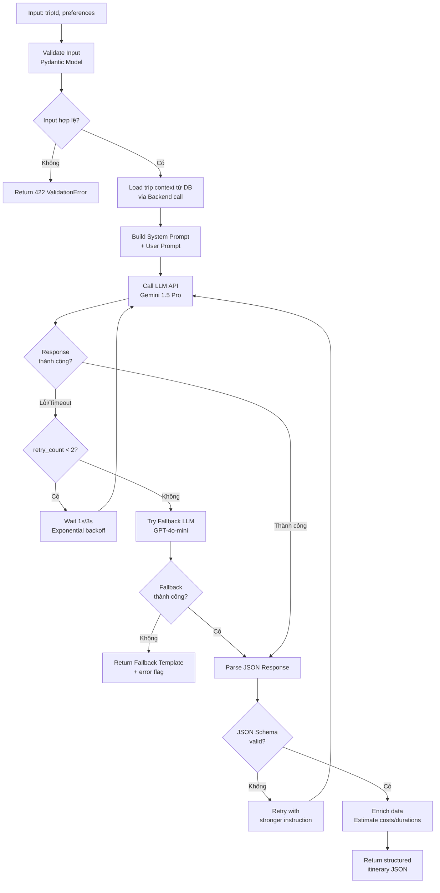
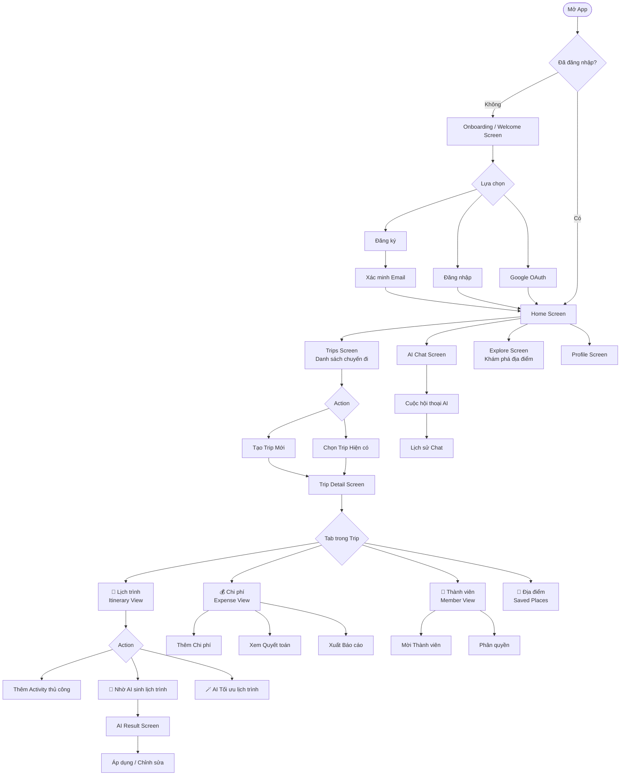

# TravelMate AI – Tài liệu Phân tích & Thiết kế Hệ thống
## Phần 5: Thiết kế AI · UI/UX · RBAC Permission Matrix

> **Phiên bản:** 1.0 | **Ngày:** 2026-07-26

---

# PHẦN 11 – THIẾT KẾ AI (PROMPT FLOW · JSON SCHEMA · ERROR HANDLING)

## 11.1 Tổng quan AI Architecture

```
┌─────────────────────────────────────────────────────────────────┐
│                     AI SERVICE – FastAPI                        │
│                                                                 │
│  Request In                                                     │
│     │                                                           │
│     ▼                                                           │
│  ┌──────────────────┐    ┌─────────────────────────────────┐   │
│  │  Input Validator  │───▶│     Context Builder             │   │
│  │  (Pydantic)       │    │  (Trip info + User prefs +      │   │
│  └──────────────────┘    │   Chat history + System prompt)  │   │
│                           └────────────┬────────────────────┘   │
│                                        │                        │
│                                        ▼                        │
│                           ┌─────────────────────────────────┐   │
│                           │       Prompt Builder             │   │
│                           │  system_prompt + few_shot +      │   │
│                           │  user_message + output_schema    │   │
│                           └────────────┬────────────────────┘   │
│                                        │                        │
│                                        ▼                        │
│                           ┌─────────────────────────────────┐   │
│                           │       LLM Client                 │   │
│                           │  Primary: Gemini 1.5 Pro         │   │
│                           │  Fallback: OpenAI GPT-4o-mini    │   │
│                           └────────────┬────────────────────┘   │
│                                        │                        │
│                                        ▼                        │
│                           ┌─────────────────────────────────┐   │
│                           │  Response Parser & Validator     │   │
│                           │  JSON Schema check + Sanitize    │   │
│                           └────────────┬────────────────────┘   │
│                                        │                        │
│                                        ▼                        │
│                                  Response Out                   │
└─────────────────────────────────────────────────────────────────┘
```

---

## 11.2 Feature 1 – AI Sinh Lịch Trình (Generate Itinerary)

### 11.2.1 Prompt Flow



### 11.2.2 System Prompt

```
You are TravelMate AI, an expert travel planner specializing in Vietnam 
and Southeast Asia travel. Your task is to create detailed, realistic,
and budget-conscious travel itineraries.

RULES:
1. Always respond in valid JSON format matching the provided schema exactly.
2. Respect the budget constraints strictly - do not suggest options 
   that exceed 120% of the stated budget per day.
3. For family trips with children, prioritize child-friendly activities.
4. Consider travel time between locations - do not schedule back-to-back 
   activities in locations more than 30 minutes apart without buffer time.
5. Include practical details: estimated costs in VND, opening hours,
   booking tips where relevant.
6. If budget is very low (< 300,000 VND/person/day), suggest street food,
   free attractions, and budget accommodation only.
7. All times should be in HH:MM 24-hour format.
8. Activity types must be one of: SIGHTSEEING, FOOD, ACCOMMODATION, 
   TRANSPORT, SHOPPING, ENTERTAINMENT, OTHER.
9. Do not include activities that are typically closed on the travel dates.
10. Language: Respond in Vietnamese unless user specifies otherwise.
```

### 11.2.3 User Prompt Template

```python
def build_generate_itinerary_prompt(context: dict) -> str:
    return f"""
Hãy lên kế hoạch du lịch chi tiết với thông tin sau:

📍 ĐIỂM ĐẾN: {context['destination']}
📅 THỜI GIAN: {context['num_days']} ngày ({context['start_date']} → {context['end_date']})
👥 SỐ NGƯỜI: {context['num_people']} người
💰 NGÂN SÁCH: {context['budget']:,} VND (toàn bộ chuyến) 
             = ~{context['budget_per_day']:,} VND/ngày
🎒 PHONG CÁCH: {context['travel_style']}
❤️  SỞ THÍCH: {', '.join(context['interests'])}
📝 YÊU CẦU ĐẶC BIỆT: {context.get('special_requests', 'Không có')}

Hãy trả về lịch trình theo JSON schema sau (KHÔNG thêm bất kỳ text nào ngoài JSON):

{ITINERARY_JSON_SCHEMA}
"""
```

### 11.2.4 JSON Schema – Input

```json
{
  "$schema": "http://json-schema.org/draft-07/schema",
  "title": "GenerateItineraryRequest",
  "type": "object",
  "required": ["tripId", "preferences"],
  "properties": {
    "tripId": {
      "type": "integer",
      "description": "ID của chuyến đi"
    },
    "preferences": {
      "type": "object",
      "required": ["travelStyle"],
      "properties": {
        "travelStyle": {
          "type": "string",
          "enum": ["ADVENTURE","RELAXATION","CULTURE","FOOD_TOUR","FAMILY","BUDGET"]
        },
        "interests": {
          "type": "array",
          "items": { "type": "string" },
          "maxItems": 10
        },
        "budgetPerDay": {
          "type": "number",
          "minimum": 0
        },
        "numPeople": {
          "type": "integer",
          "minimum": 1,
          "maximum": 50
        },
        "specialRequests": {
          "type": "string",
          "maxLength": 500
        }
      }
    }
  }
}
```

### 11.2.5 JSON Schema – Output (LLM Response)

```json
{
  "$schema": "http://json-schema.org/draft-07/schema",
  "title": "GeneratedItinerary",
  "type": "object",
  "required": ["days", "totalEstimatedCost", "tips"],
  "properties": {
    "days": {
      "type": "array",
      "minItems": 1,
      "items": {
        "type": "object",
        "required": ["dayNumber", "theme", "activities"],
        "properties": {
          "dayNumber": { "type": "integer", "minimum": 1 },
          "theme": { "type": "string", "maxLength": 100 },
          "activities": {
            "type": "array",
            "minItems": 2,
            "maxItems": 8,
            "items": {
              "type": "object",
              "required": ["name", "type", "startTime", "estimatedCost"],
              "properties": {
                "name": { "type": "string", "maxLength": 255 },
                "type": {
                  "type": "string",
                  "enum": ["SIGHTSEEING","FOOD","ACCOMMODATION",
                           "TRANSPORT","SHOPPING","ENTERTAINMENT","OTHER"]
                },
                "startTime": {
                  "type": "string",
                  "pattern": "^([01]\\d|2[0-3]):[0-5]\\d$"
                },
                "endTime": {
                  "type": ["string","null"],
                  "pattern": "^([01]\\d|2[0-3]):[0-5]\\d$"
                },
                "estimatedCost": { "type": "number", "minimum": 0 },
                "description": { "type": "string", "maxLength": 500 },
                "placeHint": { "type": ["string","null"] },
                "bookingNote": { "type": ["string","null"] }
              }
            }
          },
          "dayEstimatedCost": { "type": "number", "minimum": 0 }
        }
      }
    },
    "totalEstimatedCost": { "type": "number", "minimum": 0 },
    "tips": {
      "type": "array",
      "maxItems": 5,
      "items": { "type": "string" }
    },
    "warnings": {
      "type": "array",
      "items": { "type": "string" }
    }
  }
}
```

---

## 11.3 Feature 2 – AI Chatbot Tư vấn Du lịch

### 11.3.1 System Prompt – Chatbot

```
You are TravelMate AI Assistant, a friendly and knowledgeable travel 
consultant. You help users plan trips, answer travel questions, and 
provide personalized recommendations.

PERSONALITY: Friendly, helpful, concise. Use Vietnamese by default.
             Add relevant emojis to make responses engaging.

SCOPE: ONLY answer questions related to:
- Travel planning and itineraries
- Tourist destinations, attractions, and activities  
- Local food, restaurants, and cafes
- Hotels, homestays, and accommodation
- Transportation (flights, trains, buses, car rental)
- Weather and best times to visit
- Travel budget estimation
- Visa requirements and travel documents
- Local customs, culture, and safety tips
- Packing advice for specific destinations

OUT OF SCOPE: Refuse politely if asked about topics unrelated to travel.
Template: "Xin lỗi, mình chỉ có thể tư vấn về du lịch thôi bạn nhé! 
          Bạn có câu hỏi nào về chuyến đi không? 🗺️"

CONTEXT AWARENESS:
- You have access to the user's current trip context (if provided).
- Always tailor recommendations to the trip's destination, dates, and budget.
- Reference specific trip details when relevant.

RESPONSE FORMAT:
- Keep responses concise (under 400 words)
- Use bullet points for lists of recommendations
- Format costs in VND with comma separators (e.g., 150,000 VND)
- Always end with a helpful follow-up question when appropriate
```

### 11.3.2 Context Builder – Chatbot

```python
def build_chat_context(trip: dict | None, 
                        history: list[dict],
                        user_message: str) -> list[dict]:
    messages = []
    
    # 1. System prompt
    messages.append({
        "role": "system",
        "content": CHATBOT_SYSTEM_PROMPT
    })
    
    # 2. Trip context injection (nếu đang trong trip)
    if trip:
        trip_context = f"""
[TRIP CONTEXT]
Chuyến đi hiện tại của user:
- Điểm đến: {trip['destination']}
- Thời gian: {trip['start_date']} → {trip['end_date']} ({trip['duration']} ngày)
- Ngân sách: {trip['budget']:,} VND
- Phong cách: {trip['travel_style']}
- Số người: {trip['num_people']}
[END CONTEXT]
"""
        messages.append({
            "role": "system",
            "content": trip_context
        })
    
    # 3. Chat history (N=10 tin nhắn gần nhất)
    for msg in history[-10:]:
        messages.append({
            "role": msg["role"].lower(),
            "content": msg["content"]
        })
    
    # 4. Tin nhắn mới của user
    messages.append({
        "role": "user",
        "content": user_message
    })
    
    return messages
```

### 11.3.3 JSON Schema – Chat Input/Output

```json
// INPUT
{
  "title": "ChatRequest",
  "type": "object",
  "required": ["message"],
  "properties": {
    "conversationId": { "type": ["integer", "null"] },
    "tripId": { "type": ["integer", "null"] },
    "message": { "type": "string", "minLength": 1, "maxLength": 1000 }
  }
}

// OUTPUT
{
  "title": "ChatResponse",
  "type": "object",
  "properties": {
    "conversationId": { "type": "integer" },
    "messageId": { "type": "integer" },
    "reply": { "type": "string" },
    "isOutOfScope": { "type": "boolean" },
    "suggestedQuestions": {
      "type": "array",
      "maxItems": 3,
      "items": { "type": "string" }
    },
    "tokenCount": { "type": "integer" }
  }
}
```

---

## 11.4 Feature 3 – AI Gợi ý Địa điểm & Khách sạn

### 11.4.1 Prompt Template – Suggest Places

```python
def build_suggest_places_prompt(params: dict) -> str:
    return f"""
Gợi ý {params['count']} {params['type_label']} tại {params['city']} 
phù hợp với các tiêu chí sau:

- Ngân sách mỗi người: ~{params['budget']:,} VND
- Phong cách: {params['travel_style']}
- Sở thích: {', '.join(params['interests'])}
- Thời gian ghé thăm: {params.get('visit_time', 'Cả ngày')}
- Ghi chú đặc biệt: {params.get('special_note', 'Không có')}

Đã ghé thăm (không gợi ý lại): {params.get('visited', [])}

Trả về JSON theo schema sau. Chỉ JSON, không text thêm:
{SUGGEST_PLACES_SCHEMA}
"""
```

### 11.4.2 JSON Schema – Output (Suggest Places)

```json
{
  "title": "PlaceSuggestionsResponse",
  "type": "object",
  "required": ["suggestions"],
  "properties": {
    "suggestions": {
      "type": "array",
      "minItems": 1,
      "maxItems": 10,
      "items": {
        "type": "object",
        "required": ["rank", "name", "type", "aiReason"],
        "properties": {
          "rank": { "type": "integer", "minimum": 1 },
          "name": { "type": "string" },
          "type": {
            "type": "string",
            "enum": ["ATTRACTION","RESTAURANT","HOTEL","CAFE",
                     "SHOPPING","TRANSPORT_HUB","OTHER"]
          },
          "address": { "type": "string" },
          "estimatedCostPerPerson": { "type": "number", "minimum": 0 },
          "priceRange": {
            "type": "string",
            "enum": ["$", "$$", "$$$", "$$$$"]
          },
          "aiReason": {
            "type": "string",
            "description": "Lý do AI gợi ý (1-2 câu)",
            "maxLength": 200
          },
          "bestFor": {
            "type": "array",
            "items": { "type": "string" }
          },
          "openingNote": { "type": ["string", "null"] },
          "bookingRequired": { "type": "boolean" }
        }
      }
    }
  }
}
```

---

## 11.5 Feature 4 – AI Tối ưu Lịch trình

### 11.5.1 Prompt Template – Optimize

```python
def build_optimize_prompt(itinerary: dict) -> str:
    return f"""
Phân tích lịch trình du lịch sau và đề xuất tối ưu hóa:

LỊCH TRÌNH HIỆN TẠI:
{json.dumps(itinerary, ensure_ascii=False, indent=2)}

Hãy phân tích và đề xuất cải tiến dựa trên:
1. 🗺️  GEO CLUSTERING: Gom các địa điểm gần nhau vào cùng buổi
2. ⏰ TIME LOGIC: Tránh đến nơi trước giờ mở cửa / sau giờ đóng cửa
3. 🚗 TRAVEL EFFICIENCY: Tối thiểu hóa thời gian di chuyển giữa các điểm
4. 💸 BUDGET FLOW: Phân phối chi phí hợp lý trong ngày
5. ⚡ ENERGY MANAGEMENT: Xen kẽ hoạt động nặng/nhẹ hợp lý

Với MỖI đề xuất, hãy giải thích RÕ RÀNG lý do bằng tiếng Việt.

Trả về JSON theo schema sau:
{OPTIMIZE_SCHEMA}
"""
```

### 11.5.2 JSON Schema – Optimize Output

```json
{
  "title": "OptimizeItineraryResponse",
  "type": "object",
  "required": ["suggestions", "summary"],
  "properties": {
    "summary": {
      "type": "object",
      "properties": {
        "totalTimeSaved": {
          "type": "string",
          "description": "Ví dụ: '~90 phút'"
        },
        "overallAssessment": { "type": "string" },
        "optimizationScore": {
          "type": "integer",
          "minimum": 0,
          "maximum": 100,
          "description": "Điểm tối ưu hiện tại (0-100)"
        }
      }
    },
    "suggestions": {
      "type": "array",
      "items": {
        "type": "object",
        "required": ["type", "reason", "impact"],
        "properties": {
          "type": {
            "type": "string",
            "enum": ["REORDER", "REMOVE", "ADD_BUFFER", "CHANGE_TIME", "SPLIT_DAY"]
          },
          "affectedDayNumber": { "type": "integer" },
          "activityName": { "type": "string" },
          "reason": {
            "type": "string",
            "description": "Lý do đề xuất (bằng tiếng Việt)"
          },
          "impact": {
            "type": "string",
            "description": "Lợi ích khi áp dụng"
          },
          "before": { "type": "object" },
          "after": { "type": "object" }
        }
      }
    }
  }
}
```

---

## 11.6 Error Handling & Fallback Strategy

### 11.6.1 Bảng xử lý lỗi AI

| Tình huống | Phát hiện | Xử lý | Fallback |
|------------|-----------|-------|---------|
| **LLM Timeout** (>15s) | `asyncio.TimeoutError` | Retry 2 lần (1s, 3s backoff) | Template mẫu |
| **Rate Limit từ LLM** | HTTP 429 từ Gemini/OpenAI | Chuyển sang provider phụ | GPT-4o-mini |
| **JSON Parse Error** | `json.JSONDecodeError` | Retry với prompt strict hơn | Cấu trúc rỗng + thông báo |
| **Schema Validation Fail** | `jsonschema.ValidationError` | Retry 1 lần, extract phần hợp lệ | Partial result + warning |
| **API Key Invalid** | HTTP 401/403 | Alert DevOps ngay | Ngừng AI, báo user |
| **Content Filtered** | Safety block từ LLM | Log + retry với prompt khác | Thông báo không thể xử lý |
| **Budget Exceeded** | Kiểm tra token estimate | Rút gọn context (cắt history) | Gửi với context tối thiểu |

### 11.6.2 Fallback Template – Generate Itinerary

```python
FALLBACK_ITINERARY_TEMPLATE = {
    "days": [],   # Tạo ngày rỗng theo số ngày trip
    "totalEstimatedCost": 0,
    "tips": [
        "AI đang tạm thời không khả dụng. Bạn có thể tự thêm hoạt động!",
        "Gợi ý: Tìm địa điểm trong tab 'Địa điểm' và thêm vào lịch trình.",
        "Thử lại tính năng AI sau vài phút nhé!"
    ],
    "isAIGenerated": False,
    "isFallback": True
}
```

### 11.6.3 Rate Limiting Strategy

```
User-level Rate Limits (per user per minute):
┌─────────────────────────────────┬──────────────┐
│ Feature                         │ Limit        │
├─────────────────────────────────┼──────────────┤
│ Generate Itinerary              │ 5 req/phút   │
│ Optimize Itinerary              │ 5 req/phút   │
│ Suggest Places/Hotels           │ 20 req/phút  │
│ Chat Messages                   │ 30 req/phút  │
├─────────────────────────────────┼──────────────┤
│ Daily AI budget / user          │ 50 req/ngày  │
│ Daily token budget / user       │ 100,000 tok  │
└─────────────────────────────────┴──────────────┘

Implementation: Redis INCR + EXPIRE
Key pattern: rate_limit:{userId}:{feature}:{minute_bucket}
```

---

# PHẦN 12 – THIẾT KẾ UI/UX

## 12.1 User Flow Tổng quan



---

## 12.2 Wireframe Mô tả Chi tiết

### Screen 01 – Onboarding / Welcome

```
┌─────────────────────────────┐
│   [Ảnh minh họa du lịch]    │
│   (Slide 1/3 – 3 màn giới   │
│    thiệu tính năng chính)    │
│                             │
│   TravelMate AI             │
│   "Người bạn đồng hành      │
│    thông minh cho mọi       │
│    chuyến đi"               │
│                             │
│   ○ ● ○  (pagination dots)  │
│                             │
│  ┌─────────────────────┐    │
│  │  Bắt đầu ngay       │    │ ← CTA Primary
│  └─────────────────────┘    │
│  ┌─────────────────────┐    │
│  │  Đăng nhập          │    │ ← CTA Secondary
│  └─────────────────────┘    │
│   Đăng nhập với Google 🔵   │
└─────────────────────────────┘
Elements: Lottie animation, Animated dot indicator,
          Skip button (top right)
```

---

### Screen 02 – Home Screen (Tab Bar: Home / Trips / AI / Profile)

```
┌─────────────────────────────┐
│  👋 Xin chào, Khoa!         │
│  [Avatar]   Thứ 7, 26/7     │
├─────────────────────────────┤
│  🚀 CHUYẾN ĐI SẮP TỚI      │
│  ┌───────────────────────┐  │
│  │ [Cover Image]         │  │
│  │ Đà Lạt 5N4Đ           │  │
│  │ 📅 10 – 14/08/2026    │  │
│  │ 👥 4 người  💰 5tr    │  │
│  │ ██████░░░░  60% ngân sách│
│  └───────────────────────┘  │
├─────────────────────────────┤
│  ✨ AI GỢI Ý HÔM NAY        │
│  ┌──────┐ ┌──────┐ ┌──────┐ │
│  │Đà Nẵng│ │ Huế  │ │Hội An│ │
│  │ 3N2Đ │ │ 2N1Đ │ │ 4N3Đ │ │
│  └──────┘ └──────┘ └──────┘ │
├─────────────────────────────┤
│  💬 HỎI AI NGAY             │
│  ┌─────────────────────────┐│
│  │ "Tháng 8 nên đi đâu?" 🎤││
│  └─────────────────────────┘│
├─────────────────────────────┤
│ [🏠Home] [✈️Trips] [🤖AI] [👤] │
└─────────────────────────────┘
```

---

### Screen 03 – Trip List Screen

```
┌─────────────────────────────┐
│  ✈️ Chuyến đi của tôi   [+] │ ← FAB tạo trip mới
│  🔍 Tìm kiếm chuyến đi...  │
│  [Tất cả] [Sắp tới] [Đang đi] [Hoàn thành] │ ← Filter tabs
├─────────────────────────────┤
│  SẮP TỚI                    │
│  ┌───────────────────────┐  │
│  │ [Cover]   Đà Lạt 5N4Đ│  │
│  │           10–14/08    │  │
│  │ 👥4  💰5tr  OWNER    │  │
│  └───────────────────────┘  │
│  ┌───────────────────────┐  │
│  │ [Cover]   Hội An 3N2Đ│  │
│  │           20–22/09    │  │
│  │ 👥2  💰3tr  EDITOR   │  │
│  └───────────────────────┘  │
├─────────────────────────────┤
│  ĐANG ĐI 🔴 LIVE            │
│  ┌───────────────────────┐  │
│  │ [Cover]  Hà Nội 4N3Đ │  │
│  │ [LIVE] Ngày 2/4       │  │
│  └───────────────────────┘  │
└─────────────────────────────┘
```

---

### Screen 04 – Trip Detail Screen

```
┌─────────────────────────────┐
│ ← [Cover Image Full Width]  │
│ Đà Lạt 5N4Đ          ··· ▾ │ ← Options menu
│ 📅 10–14/08 · 👥4 · 💰5tr  │
│ [UPCOMING]                  │
├─────────────────────────────┤
│ [📅 Lịch trình][💰 Chi phí] │
│ [👥 Thành viên][📌 Địa điểm]│ ← Tab bar
├─────────────────────────────┤
│         LỊCH TRÌNH          │
│  ┌─────────────────────┐    │
│  │ NGÀY 1 – T7, 10/08  │    │
│  │ "Di chuyển & Nhận phòng"│
│  │ ✈ Bay SGN→DLI  6:30 │    │
│  │ 🏨 Check-in  14:00  │    │
│  │ 🍜 Ăn tối   18:30  │    │
│  │ [+ Thêm hoạt động]  │    │
│  └─────────────────────┘    │
│                             │
│  ┌─────────────────────┐    │
│  │ 🤖 Nhờ AI lên kế   │    │ ← AI CTA Button
│  │    hoạch cho bạn   │    │
│  └─────────────────────┘    │
└─────────────────────────────┘
```

---

### Screen 05 – AI Generate Itinerary Screen

```
┌─────────────────────────────┐
│ ← 🤖 Tạo lịch trình với AI │
├─────────────────────────────┤
│  THÔNG TIN CHUYẾN ĐI        │
│  📍 Đà Lạt, Lâm Đồng        │
│  📅 5 ngày (10–14/08/2026)  │
│  👥 4 người                  │
│  💰 5,000,000 VND           │
├─────────────────────────────┤
│  PHONG CÁCH DU LỊCH         │
│  [Khám phá] ✅ [Nghỉ dưỡng] │
│  [Văn hóa] [Ẩm thực] [Gia đình]│
├─────────────────────────────┤
│  SỞ THÍCH BỔ SUNG           │
│  [Cà phê] ✅ [Thiên nhiên] ✅│
│  [Chụp ảnh] ✅ [Mua sắm]    │
├─────────────────────────────┤
│  YÊU CẦU ĐẶC BIỆT          │
│  ┌─────────────────────────┐│
│  │ Có trẻ em 5 tuổi, tránh││
│  │ leo núi nhiều...        ││
│  └─────────────────────────┘│
│                             │
│  ┌─────────────────────────┐│
│  │  ✨ Tạo lịch trình AI   ││ ← Primary Action
│  └─────────────────────────┘│
└─────────────────────────────┘

--- LOADING STATE ---
┌─────────────────────────────┐
│        [Lottie Animation    │
│         AI thinking...]     │
│  🤖 Đang phân tích...       │
│  ████████░░░░░░  Đang tạo  │
│  lịch trình phù hợp nhất   │
│  cho bạn. Vui lòng chờ...   │
└─────────────────────────────┘
```

---

### Screen 06 – AI Chat Screen

```
┌─────────────────────────────┐
│ ← 🤖 TravelMate AI    🗑️   │
│ [Context: Chuyến Đà Lạt 🔵] │ ← Chip hiện trip context
├─────────────────────────────┤
│                             │
│  [🤖] Xin chào Khoa! Mình   │ ← AI bubble (trái)
│  là TravelMate AI. Hỏi mình │
│  bất kỳ điều gì về chuyến   │
│  Đà Lạt của bạn nhé! 🗺️    │
│                             │
│          Tháng 8 đi Đà Lạt │ ← User bubble (phải)
│          thời tiết thế nào? │
│                          [👤]│
│                             │
│  [🤖] Tháng 8 là mùa mưa... │
│  ...                        │
│  • 🧥 Mang áo khoác nhẹ    │
│  • ⏰ Hoạt động ngoài trời  │
│    vào buổi sáng           │
│                             │
│  Quick replies:             │
│  [Gợi ý café Đà Lạt?]      │
│  [Thời tiết tốt nhất?]     │
├─────────────────────────────┤
│ ┌─────────────────────┐ [🎤]│
│ │ Hỏi về du lịch...   │ [➤] │ ← Input + Send
│ └─────────────────────┘     │
└─────────────────────────────┘
```

---

### Screen 07 – Expense Screen

```
┌─────────────────────────────┐
│ ← 💰 Chi phí – Đà Lạt      │
│ [Tổng kết][Danh sách][Quyết toán]│
├─────────────────────────────┤
│  TỔNG QUAN                  │
│  ┌─────────────────────────┐│
│  │  12,500,000 / 15,000,000││
│  │  ██████████░░ 83%       ││
│  │  💸 Đã chi   🎯 Ngân sách││
│  └─────────────────────────┘│
│                             │
│  THEO DANH MỤC              │
│  [Pie Chart Donut]          │
│  🍜 Ăn uống     35% 4.4tr  │
│  🚗 Di chuyển   28% 3.5tr  │
│  🏨 Lưu trú     25% 3.1tr  │
│  🎡 Vui chơi    12% 1.5tr  │
├─────────────────────────────┤
│  DANH SÁCH CHI PHÍ          │
│  T7 10/08                   │
│  🍜 Bữa tối  840,000đ  An  │
│  🚗 Taxi     200,000đ  Minh│
│                        [+ ] │ ← FAB thêm chi phí
└─────────────────────────────┘
```

---

### Screen 08 – Member & Permission Screen

```
┌─────────────────────────────┐
│ ← 👥 Thành viên (4)         │
│                   [+ Mời]   │
├─────────────────────────────┤
│  [Avatar] Nguyễn Văn An     │
│           an@gmail.com      │
│           👑 OWNER          │
│                             │
│  [Avatar] Trần Minh         │
│           minh@gmail.com    │
│           ✏️ EDITOR    [···]│ ← 3 dots: Đổi quyền / Xóa
│                             │
│  [Avatar] Lê Thị Lan        │
│           lan@gmail.com     │
│           👁️ VIEWER    [···]│
│                             │
│  [Avatar] Phạm Huy          │
│           huy@gmail.com     │
│           ⏳ Pending   [···]│
├─────────────────────────────┤
│  QUYỀN HẠN THEO VAI TRÒ    │
│  ┌────────────┬──────┬────┐ │
│  │ Tính năng  │ Edit │View│ │
│  ├────────────┼──────┼────┤ │
│  │ Lịch trình │  ✅  │ ✅ │ │
│  │ Chi phí    │  ✅  │ ✅ │ │
│  │ Thành viên │  ❌  │ ✅ │ │
│  └────────────┴──────┴────┘ │
└─────────────────────────────┘
```

---

### Screen 09 – Place Search & Detail Screen

```
┌─────────────────────────────┐
│ ← 📍 Tìm địa điểm          │
│  🔍 Nhập tên địa điểm...   │
│  [Tất cả][🍜 Ăn uống][🏨 KS]│
│  [☕ Café][🎡 Vui chơi]     │
├─────────────────────────────┤
│  📍 Đà Lạt · 28 kết quả    │
│  ┌───────────────────────┐  │
│  │[Img] The Married Beans│  │
│  │      ☕ Café · $$     │  │
│  │      ⭐ 4.7 · 03 Tống │  │
│  │      Duy Tân           │  │
│  │      [💾 Lưu] [➕ Thêm]│ │
│  └───────────────────────┘  │

--- DETAIL SCREEN ---
┌─────────────────────────────┐
│ [Ảnh địa điểm full width]   │
│ The Married Beans       [♥] │
│ ⭐ 4.7 (127 đánh giá)       │
│ ☕ Café · $$ · Đà Lạt       │
│ 📍 03 Tống Duy Tân, P1, ĐL  │
│ ⏰ 7:00 – 22:00 (Đang mở)  │
│ 📞 0263 3822 xxx            │
│                             │
│ 🤖 AI nhận xét:             │
│ "Quán có view đẹp nhìn ra   │
│  thung lũng, phù hợp buổi  │
│  sáng chụp ảnh..."         │
│                             │
│ ┌──────────┐ ┌────────────┐ │
│ │ 🗺️ Bản đồ│ │➕ Vào lịch │ │
│ └──────────┘ └────────────┘ │
└─────────────────────────────┘
```

---

### Screen 10 – Admin Dashboard

```
┌─────────────────────────────────────────┐
│  TravelMate Admin                 [🔔][👤]│
├──────────┬──────────────────────────────┤
│ SIDEBAR  │    DASHBOARD OVERVIEW        │
│ 📊 Dash  │  ┌────────┐ ┌────────┐      │
│ 👥 Users │  │ 1,250  │ │  430   │      │
│ ✈️ Trips │  │  Users │ │  MAU   │      │
│ 📍 Places│  └────────┘ └────────┘      │
│ 🤖 AI Log│  ┌────────┐ ┌────────┐      │
│ ⚙️ Config│  │ 4,320  │ │ 97.3%  │      │
│          │  │  Trips │ │ AI OK  │      │
│          │  └────────┘ └────────┘      │
│          │                             │
│          │  📈 Người dùng mới (7 ngày) │
│          │  [Bar Chart]                │
│          │                             │
│          │  🗺️ Top điểm đến            │
│          │  1. Đà Lạt    892 trips     │
│          │  2. Hội An    741 trips     │
│          │  3. Hà Nội    623 trips     │
│          │                             │
│          │  ⚠️ AI Errors (hôm nay): 3  │
│          │  [Xem chi tiết]             │
└──────────┴─────────────────────────────┘
```

---

## 12.3 Design System – Token & Style Guide

| Token | Giá trị | Sử dụng |
|-------|---------|---------|
| `color-primary` | `#6C63FF` (Indigo) | Button, active tab, CTA |
| `color-secondary` | `#FF6B6B` (Coral) | Warning, expense alert |
| `color-accent` | `#4ECDC4` (Teal) | AI features, success |
| `color-bg` | `#0F0F1A` (Dark Navy) | Dark mode background |
| `color-surface` | `#1A1A2E` (Card BG) | Card, modal background |
| `color-text-primary` | `#FFFFFF` | Heading text |
| `color-text-secondary` | `#A8A8B3` | Subtext, labels |
| `font-heading` | `Outfit Bold` | H1, H2 titles |
| `font-body` | `Inter Regular` | Body text |
| `border-radius-card` | `16px` | Card corners |
| `border-radius-button` | `12px` | Button corners |
| `shadow-card` | `0 4px 24px rgba(0,0,0,0.4)` | Card elevation |

---

# PHẦN 13 – PHÂN QUYỀN (RBAC – PERMISSION MATRIX)

## 13.1 Định nghĩa Roles

| Role | Phạm vi | Mô tả |
|------|---------|-------|
| **ADMIN** | Hệ thống | Quản trị viên toàn hệ thống, truy cập admin dashboard |
| **USER** | Hệ thống | Người dùng thông thường, có thể tạo và tham gia trips |
| **OWNER** | Trip-level | Chủ sở hữu chuyến đi, toàn quyền |
| **EDITOR** | Trip-level | Thành viên có quyền chỉnh sửa |
| **VIEWER** | Trip-level | Thành viên chỉ xem, không chỉnh sửa |
| **GUEST** | Public | Chưa đăng nhập, chỉ xem nội dung public |

## 13.2 Permission Matrix – Hệ thống

| Chức năng | GUEST | USER | ADMIN |
|-----------|:-----:|:----:|:-----:|
| Xem trang chủ / landing | ✅ | ✅ | ✅ |
| Đăng ký / Đăng nhập | ✅ | — | — |
| Tạo chuyến đi | ❌ | ✅ | ✅ |
| Xem trips của mình | ❌ | ✅ | ✅ |
| Sử dụng AI Chat (global) | ❌ | ✅ | ✅ |
| Tìm kiếm địa điểm | ❌ | ✅ | ✅ |
| Quản lý profile | ❌ | ✅ | ✅ |
| **Xem Admin Dashboard** | ❌ | ❌ | ✅ |
| **Quản lý toàn bộ Users** | ❌ | ❌ | ✅ |
| **Khoá/Xoá User** | ❌ | ❌ | ✅ |
| **Quản lý Places (system)** | ❌ | ❌ | ✅ |
| **Xem AI usage logs** | ❌ | ❌ | ✅ |

## 13.3 Permission Matrix – Trip Level

| Chức năng | OWNER | EDITOR | VIEWER |
|-----------|:-----:|:------:|:------:|
| **TRIP** | | | |
| Xem thông tin trip | ✅ | ✅ | ✅ |
| Chỉnh sửa thông tin trip | ✅ | ✅ | ❌ |
| Xóa trip | ✅ | ❌ | ❌ |
| Upload ảnh bìa | ✅ | ✅ | ❌ |
| **ITINERARY** | | | |
| Xem lịch trình | ✅ | ✅ | ✅ |
| Thêm / Sửa / Xóa hoạt động | ✅ | ✅ | ❌ |
| Sắp xếp lại hoạt động | ✅ | ✅ | ❌ |
| Cập nhật trạng thái activity | ✅ | ✅ | ❌ |
| **AI – trong Trip** | | | |
| AI sinh lịch trình | ✅ | ✅ | ❌ |
| AI tối ưu lịch trình | ✅ | ✅ | ❌ |
| AI Chatbot (với trip context) | ✅ | ✅ | ✅ |
| AI gợi ý địa điểm | ✅ | ✅ | ✅ |
| **EXPENSE** | | | |
| Xem chi phí & thống kê | ✅ | ✅ | ✅ |
| Thêm / Sửa / Xóa chi phí | ✅ | ✅ | ❌ |
| Đánh dấu đã thanh toán | ✅ | ✅ | ❌ |
| Xuất báo cáo PDF/CSV | ✅ | ✅ | ✅ |
| **MEMBERS** | | | |
| Xem danh sách thành viên | ✅ | ✅ | ✅ |
| Mời thành viên | ✅ | ❌ | ❌ |
| Thay đổi vai trò thành viên | ✅ | ❌ | ❌ |
| Xóa thành viên | ✅ | ❌ | ❌ |
| Tự rời khỏi trip | ❌ | ✅ | ✅ |
| **PLACES** | | | |
| Xem địa điểm đã lưu | ✅ | ✅ | ✅ |
| Lưu / Bỏ lưu địa điểm | ✅ | ✅ | ❌ |
| Thêm địa điểm vào lịch trình | ✅ | ✅ | ❌ |
| Đánh giá địa điểm | ✅ | ✅ | ✅ |
| **SHARING** | | | |
| Tạo link chia sẻ công khai | ✅ | ❌ | ❌ |
| Vô hiệu hoá link chia sẻ | ✅ | ❌ | ❌ |

## 13.4 Implement RBAC trong Spring Boot

### 13.4.1 Annotation-based Authorization

```java
// Custom annotations
@Target(ElementType.METHOD)
@Retention(RetentionPolicy.RUNTIME)
@PreAuthorize("hasRole('ADMIN')")
public @interface AdminOnly {}

@Target(ElementType.METHOD)
@Retention(RetentionPolicy.RUNTIME)
@PreAuthorize("@tripSecurityService.isOwnerOrEditor(#tripId, authentication)")
public @interface RequiresTripEditor {}

@Target(ElementType.METHOD)
@Retention(RetentionPolicy.RUNTIME)
@PreAuthorize("@tripSecurityService.isMember(#tripId, authentication)")
public @interface RequiresTripMember {}

// Sử dụng trong Controller
@GetMapping("/trips/{tripId}/itinerary")
@RequiresTripMember          // Viewer, Editor, Owner đều xem được
public ResponseEntity<?> getItinerary(@PathVariable Long tripId) { ... }

@PostMapping("/trips/{tripId}/itinerary/days/{dayId}/activities")
@RequiresTripEditor          // Chỉ Editor và Owner mới thêm được
public ResponseEntity<?> addActivity(@PathVariable Long tripId, ...) { ... }

@DeleteMapping("/trips/{tripId}")
@PreAuthorize("@tripSecurityService.isOwner(#tripId, authentication)")
public ResponseEntity<?> deleteTrip(@PathVariable Long tripId) { ... }
```

### 13.4.2 TripSecurityService

```java
@Service
public class TripSecurityService {

    public boolean isMember(Long tripId, Authentication auth) {
        Long userId = extractUserId(auth);
        return tripMemberRepository
            .existsByTripIdAndUserId(tripId, userId);
    }

    public boolean isOwnerOrEditor(Long tripId, Authentication auth) {
        Long userId = extractUserId(auth);
        return tripMemberRepository
            .existsByTripIdAndUserIdAndRoleIn(
                tripId, userId,
                List.of(TripRole.OWNER, TripRole.EDITOR)
            );
    }

    public boolean isOwner(Long tripId, Authentication auth) {
        Long userId = extractUserId(auth);
        return tripMemberRepository
            .existsByTripIdAndUserIdAndRole(
                tripId, userId, TripRole.OWNER
            );
    }
}
```

### 13.4.3 Security Filter Chain

```java
@Configuration
@EnableMethodSecurity(prePostEnabled = true)
public class SecurityConfig {

    @Bean
    public SecurityFilterChain filterChain(HttpSecurity http) throws Exception {
        return http
            .csrf(AbstractHttpConfigurer::disable)
            .sessionManagement(s -> s
                .sessionCreationPolicy(SessionCreationPolicy.STATELESS))
            .authorizeHttpRequests(auth -> auth
                // Public endpoints
                .requestMatchers("/api/v1/auth/**").permitAll()
                .requestMatchers(GET, "/api/v1/trips/public/**").permitAll()
                // Admin only
                .requestMatchers("/api/v1/admin/**").hasRole("ADMIN")
                // All authenticated users
                .anyRequest().authenticated()
            )
            .addFilterBefore(jwtAuthFilter, 
                UsernamePasswordAuthenticationFilter.class)
            .build();
    }
}
```

---

> **📌 Kết thúc Phần 5** – Bao gồm: Thiết kế AI (Prompt Flow, JSON Schema, Error Handling cho 4 tính năng AI), UI/UX (User Flow Mermaid + Wireframe 10 màn hình + Design System tokens), RBAC Permission Matrix (hệ thống + trip-level) + implement Spring Boot.
>
> Gõ **"Tiếp tục"** để nhận **Phần 6 (cuối)**: Test Plan · Test Cases · Kế hoạch triển khai & phân chia công việc nhóm 3 người.
