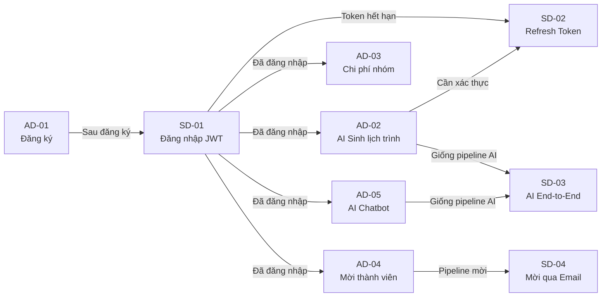

# TravelMate AI – Mô tả Chi tiết Các Sơ đồ trong Phần 3
## Supplement to Part 3: Activity Diagrams & Sequence Diagrams

> **Phiên bản:** 1.0 | **Ngày:** 2026-07-26  
> **Mục đích:** Giải thích chi tiết logic, luồng xử lý và quyết định thiết kế của từng sơ đồ trong Phần 3.

---

# A. MÔ TẢ CHI TIẾT ACTIVITY DIAGRAMS

> **Activity Diagram** mô tả luồng hoạt động (workflow) từ góc nhìn quy trình nghiệp vụ, tập trung vào **trình tự các bước**, **điều kiện rẽ nhánh** và **xử lý ngoại lệ**.

---

## AD-01 – Đăng ký & Xác minh Tài khoản

### Mục đích sơ đồ
Mô tả toàn bộ quy trình một Guest tạo tài khoản mới trên TravelMate AI, từ khi điền form đến khi tài khoản được kích hoạt thành công. Sơ đồ này bao gồm cả nhánh xử lý khi email xác minh hết hạn.

### Các thành phần tham gia (Swimlanes)

| Thành phần | Vai trò trong sơ đồ |
|------------|-------------------|
| **Guest (User)** | Điền form, nhận email, bấm link xác minh |
| **React Native App** | Validate client-side, hiển thị phản hồi |
| **Spring Boot Backend** | Validate server-side, tạo User, gửi yêu cầu email |
| **Email Service** | Gửi email xác minh đến hộp thư của Guest |
| **MySQL Database** | Lưu trữ bản ghi User với trạng thái PENDING |

### Mô tả từng bước chi tiết

**Bước 1 – Mở màn hình Đăng ký:**  
Guest khởi động ứng dụng lần đầu và chọn "Đăng ký". App hiển thị form gồm 4 trường: Họ tên, Email, Mật khẩu, Xác nhận mật khẩu.

**Bước 2 – Nhập thông tin:**  
Guest điền vào các trường. App thực hiện **client-side validation real-time** (validate ngay khi user ngừng gõ) để cải thiện UX, giảm số lần gọi API thất bại không cần thiết.

**Bước 3 – Decision: Validate đầu vào?**  
Đây là điểm quyết định đầu tiên. App kiểm tra:
- Họ tên: không rỗng, ≤ 100 ký tự
- Email: đúng định dạng RFC 5322
- Mật khẩu: ≥ 8 ký tự, có ít nhất 1 chữ hoa, 1 chữ thường, 1 số
- Xác nhận mật khẩu: khớp với mật khẩu

→ **Nếu KHÔNG hợp lệ:** Hiển thị lỗi inline bên dưới trường tương ứng (màu đỏ), vòng lặp quay về Bước 2.  
→ **Nếu HỢP LỆ:** Tiếp tục gọi API backend.

> **Lý do thiết kế:** Validate ở client trước giúp giảm tải server và tăng trải nghiệm người dùng. Tuy nhiên, server vẫn phải validate lại vì client-side validation có thể bị bypass.

**Bước 4 – Gửi request đến Backend:**  
App gọi `POST /api/v1/auth/register` với payload JSON. Backend thực hiện **server-side validation** một lần nữa.

**Bước 5 – Decision: Email đã tồn tại?**  
Backend query database: `SELECT COUNT(*) FROM users WHERE email = ? AND deleted_at IS NULL`.

→ **Nếu CÓ:** Trả về HTTP 409 với error code `EMAIL_ALREADY_EXISTS`. App hiển thị thông báo lỗi, vòng lặp quay về Bước 2.  
→ **Nếu KHÔNG:** Tiếp tục tạo tài khoản.

**Bước 6 – Tạo User PENDING:**  
Backend thực hiện:
1. Hash mật khẩu bằng BCrypt (cost factor = 12)
2. Insert bản ghi User vào database với `status = PENDING`
3. Sinh `email_verification_token` (UUID, lưu vào bảng `email_verifications`, hiệu lực 24 giờ)

**Bước 7 – Gửi email xác minh:**  
Backend gọi Email Service (SendGrid/SMTP). Email chứa link dạng:  
`https://app.travelmate.ai/verify-email?token=<UUID>`

**Bước 8 – Hiển thị thông báo chờ:**  
App hiển thị màn hình "Kiểm tra hộp thư của bạn" với animation bao thư và hướng dẫn. Có nút "Gửi lại email" (bị disable trong 60 giây).

**Bước 9 – Decision: User mở email?**  
Đây là điểm chờ bất đồng bộ (asynchronous wait). Có hai nhánh:

→ **Nhánh KHÔNG mở trong 24h:** Token hết hạn. Nếu user sau đó mở app và yêu cầu gửi lại, hệ thống sinh token mới và gửi email mới. Tài khoản vẫn ở trạng thái PENDING cho đến khi xác minh.

→ **Nhánh CÓ:** User bấm link trong email → App/Browser gọi `GET /api/v1/auth/verify-email?token=<UUID>`.

**Bước 10 – Decision: Link còn hiệu lực?**  
Backend kiểm tra: `SELECT * FROM email_verifications WHERE token = ? AND expires_at > NOW() AND used = 0`

→ **Hết hạn:** Trả về trang lỗi với nút "Gửi lại email xác minh".  
→ **Còn hiệu lực:** Cập nhật User `status = ACTIVE`, đánh dấu token `used = 1`, redirect sang Login.

### Điểm thiết kế đáng chú ý

| Vấn đề | Giải pháp thiết kế |
|--------|-------------------|
| Token bị dùng lại | Cột `used = 1` sau khi xác minh; token chỉ dùng được 1 lần |
| Email gửi thất bại | Log lỗi, retry tự động 3 lần với exponential backoff |
| User tạo nhiều tài khoản với email chưa verify | Cho phép tạo lại nếu trạng thái PENDING quá 24h → xóa bản ghi cũ |
| Brute force token | Token là UUID v4 (entropy đủ cao), không có endpoint để đoán |

---

## AD-02 – AI Sinh Lịch trình Tự động

### Mục đích sơ đồ
Mô tả toàn bộ pipeline từ khi User bấm "Nhờ AI lên kế hoạch" đến khi lịch trình được lưu vào database và hiển thị lên màn hình. Đây là sơ đồ phức tạp nhất, thể hiện kiến trúc 3 tầng (Client → Backend → AI Service) cùng cơ chế retry và fallback.

### Các thành phần tham gia

| Thành phần | Vai trò |
|------------|---------|
| **User (Owner/Editor)** | Kích hoạt tính năng, xem kết quả |
| **React Native App** | Hiển thị dialog, loading state, kết quả AI |
| **Spring Boot Backend** | Orchestrator: kiểm tra auth, rate limit, lưu DB |
| **Python FastAPI AI Service** | Xây dựng prompt, gọi LLM, parse response |
| **LLM API (Gemini/OpenAI)** | Sinh nội dung lịch trình |
| **MySQL Database** | Lưu lịch trình kết quả |
| **Redis** | Kiểm tra và cập nhật rate limit |

### Mô tả từng bước chi tiết

**Bước 1 – Kiểm tra điều kiện tiên quyết:**  
Trước khi hiện nút "Nhờ AI", App kiểm tra trip đã có đủ thông tin chưa (điểm đến, ngày đi, ngày về). Nếu thiếu → yêu cầu bổ sung. Đây là **guard clause** để tránh request AI vô nghĩa.

**Bước 2 – Dialog xác nhận:**  
Hiển thị dialog tóm tắt các tham số sẽ gửi cho AI: điểm đến, số ngày, ngân sách, phong cách, sở thích. Cho phép user chỉnh sửa nếu muốn. Nếu user hủy → không làm gì.

**Bước 3 – Loading state:**  
App hiển thị skeleton loading animation với các thông điệp động ("Đang phân tích điểm đến...", "Đang lên kế hoạch...") để giảm cảm giác chờ đợi.

**Bước 4 – Kiểm tra Rate Limit (Backend):**  
Backend kiểm tra Redis key `rate_limit:{userId}:generate_itinerary:{minute_bucket}`.  
- Nếu vượt giới hạn (5 req/phút): trả về HTTP 429, thông báo user chờ X giây.  
- Nếu OK: tăng counter và tiếp tục.

> **Lý do thiết kế:** Rate limit ngăn lạm dụng AI API (chi phí cao) và bảo vệ hệ thống khỏi flood request.

**Bước 5 – Backend gọi AI Service:**  
Backend gửi HTTP POST đến FastAPI với payload gồm: điểm đến, số ngày, ngân sách/ngày, phong cách, danh sách sở thích, yêu cầu đặc biệt.

**Bước 6 – AI Service xây dựng Prompt:**  
FastAPI thực hiện:
1. Load system prompt từ config (có thể A/B test)
2. Inject thông tin trip vào user prompt template
3. Tính toán token budget để không vượt giới hạn LLM
4. Thêm JSON schema vào cuối prompt để ràng buộc output format

**Bước 7 – Gọi LLM với Retry Logic:**  
FastAPI gọi Gemini API. Nếu timeout hoặc lỗi:
- Retry lần 1: chờ 1 giây (exponential backoff)
- Retry lần 2: chờ 3 giây
- Sau 2 lần retry thất bại: thử LLM fallback (GPT-4o-mini)
- Nếu cả fallback cũng thất bại: trả về template rỗng có flag `isFallback = true`

**Bước 8 – Parse và Validate JSON:**  
FastAPI parse response text thành JSON và validate theo `GeneratedItinerary` JSON Schema. Nếu JSON không hợp lệ:
- Thử retry 1 lần với prompt có instruction "Chỉ trả về JSON thuần túy, không thêm text"
- Nếu vẫn thất bại: dùng fallback

**Bước 9 – Lưu vào Database (Transaction):**  
Backend thực hiện trong 1 database transaction:
1. Xóa lịch trình cũ nếu đây là lần sinh lại (`DELETE FROM activities WHERE itinerary_day_id IN (...)`)
2. Insert các bản ghi `activities` cho từng ngày
3. Commit transaction

> **Lý do dùng transaction:** Đảm bảo tính nhất quán – hoặc lưu toàn bộ lịch trình mới, hoặc giữ nguyên lịch trình cũ. Không để tình trạng nửa vời.

**Bước 10 – Hiển thị kết quả với Animation:**  
App nhận response, ẩn loading skeleton, dùng animation "reveal" để hiển thị từng ngày lịch trình (slide-in từ dưới lên). User có 3 lựa chọn: Áp dụng, Chỉnh sửa, hoặc Sinh lại.

### Điểm thiết kế đáng chú ý

| Tình huống | Cách xử lý |
|------------|-----------|
| User sinh lại nhiều lần | Xóa lịch trình cũ trước khi lưu mới (tránh duplicate) |
| AI tạo hoạt động không thực tế | JSON Schema ràng buộc format, Backend validate thêm business rules |
| Chi phí AI vượt ngân sách | System prompt có rule strict về budget; warn user nếu ước tính vượt |
| Lịch trình AI quá dày đặc | System prompt giới hạn max 8 activity/ngày |

---

## AD-03 – Quản lý Chi phí Nhóm & Chia tiền

### Mục đích sơ đồ
Mô tả luồng ghi nhận chi phí nhóm và tính toán quyết toán (ai nợ ai bao nhiêu). Đây là tính năng quan trọng cho chuyến đi nhiều người, thường phát sinh tranh cãi nếu không minh bạch.

### Các thành phần tham gia

| Thành phần | Vai trò |
|------------|---------|
| **Owner / Editor** | Nhập chi phí, quản lý quyết toán |
| **Viewer** | Chỉ xem thống kê và danh sách |
| **React Native App** | Form nhập, dashboard, biểu đồ |
| **Spring Boot Backend** | Tính toán split, cập nhật balance sheet |
| **MySQL Database** | Lưu expenses và expense_splits |

### Mô tả từng bước chi tiết

**Bước 1 – Kiểm tra vai trò:**  
Ngay khi vào màn hình Chi phí, hệ thống xác định vai trò của user trong trip. Viewer chỉ thấy thống kê và danh sách (read-only). Owner/Editor có thêm nút "+" để thêm chi phí.

> **Lý do:** Tránh confusion UX – Viewer không thấy nút mà bấm rồi bị báo lỗi.

**Bước 2 – Form thêm chi phí:**  
Form gồm: Tên khoản chi, Số tiền (chỉ nhận số dương), Danh mục (6 loại), Ngày (mặc định hôm nay), Người chi (mặc định: mình), và phần chia tiền.

**Bước 3 – Chọn kiểu chia tiền (Decision Node quan trọng):**

| Kiểu chia | Logic | Ví dụ |
|-----------|-------|-------|
| **EQUAL** | Chia đều cho tất cả người được chọn | 840,000đ ÷ 4 = 210,000đ/người |
| **CUSTOM** | Nhập số tiền cụ thể cho từng người | A: 300k, B: 250k, C: 290k |
| **SINGLE** | Chỉ một người chịu toàn bộ | Vé cáp treo cho riêng A |

**Bước 4 – Validate tổng tiền:**  
Với kiểu CUSTOM, Backend kiểm tra: `SUM(custom_amounts) == expense.amount`. Nếu lệch → báo lỗi, yêu cầu điều chỉnh. Đây là validation business logic quan trọng.

**Bước 5 – Lưu và cập nhật Balance Sheet:**  
Backend insert vào bảng `expenses` và `expense_splits`. Sau đó tính lại balance sheet bằng thuật toán:

```
Balance = ∑(paid_by user) - ∑(owed by user)
→ Dương: người khác nợ user này
→ Âm: user này nợ người khác

Tối giản hoá nợ: dùng greedy algorithm để giảm số lượng giao dịch thanh toán
```

**Bước 6 – Cảnh báo ngân sách:**  
Sau mỗi lần thêm chi phí, hệ thống tính lại `(total_expense / budget) * 100`. Nếu vượt 80% → hiển thị toast warning màu cam. Nếu vượt 100% → warning màu đỏ.

**Bước 7 – Xuất báo cáo:**  
Khi user bấm "Xuất PDF": Backend dùng thư viện (iText/JasperReports) tạo PDF gồm: tổng kết theo danh mục, danh sách chi tiết, bảng quyết toán. Trả về file download.

### Điểm thiết kế đáng chú ý

| Vấn đề | Giải pháp |
|--------|-----------|
| Làm tròn số khi chia đều | Dư 1-2đ gán cho người chi (người đã bỏ tiền ra) |
| Thành viên rời trip còn nợ | Vẫn giữ bản ghi nợ, chỉ xóa quyền truy cập trip |
| Đa tiền tệ | V1 chỉ hỗ trợ VND; ghi chú trong expense nếu là ngoại tệ |
| Đánh dấu đã thanh toán | `is_settled` flag trên từng split; không xóa bản ghi |

---

## AD-04 – Mời Thành viên & Phân quyền

### Mục đích sơ đồ
Mô tả hai con đường mời thành viên (qua email và qua link), vòng đời của invitation (pending → accepted/declined/expired), và quy trình thay đổi vai trò sau khi gia nhập.

### Các thành phần tham gia

| Thành phần | Vai trò |
|------------|---------|
| **Trip Owner** | Khởi tạo lời mời, phân quyền |
| **Người được mời** | Nhận và phản hồi lời mời |
| **Email Service** | Gửi email mời |
| **Backend** | Quản lý token, xác thực, cập nhật phân quyền |

### Mô tả từng bước chi tiết

**Bước 1 – Kiểm tra quyền:**  
Chỉ Owner mới được mời thành viên. Nếu Editor/Viewer cố truy cập endpoint này → Backend trả về 403 Forbidden ngay lập tức.

**Bước 2 – Chọn phương thức mời:**

**Luồng A – Qua Email:**
1. Owner nhập email người được mời và chọn vai trò (Editor hoặc Viewer)
2. Backend kiểm tra email có phải user đã có tài khoản không:
   - **Có tài khoản:** Tạo invitation với `invitee_id` đã biết
   - **Chưa có:** Tạo invitation với `invitee_email` (người nhận đăng ký sau sẽ được link)
3. Sinh invitation token (UUID, expire sau 7 ngày)
4. Gửi email với deep link: `travelmate://invitations/accept?token=<UUID>`
5. Người nhận xuất hiện trong danh sách thành viên với badge "Pending"

**Luồng B – Qua Link:**
1. Backend tạo link mời có thể tái sử dụng, expire sau 7 ngày
2. Owner copy link và chia sẻ qua bất kỳ kênh nào (Zalo, Messenger...)
3. Người nhận bấm link → App/Browser xử lý deep link:
   - Chưa đăng ký → Redirect đến màn hình đăng ký → Sau khi đăng ký tự động gia nhập trip với vai trò mặc định (Viewer)
   - Đã đăng nhập → Hiển thị popup xác nhận gia nhập

**Bước 3 – Xử lý phản hồi lời mời (Luồng A):**

| Hành động | Kết quả |
|-----------|---------|
| Chấp nhận | Insert vào `trip_members` với role đã chọn; cập nhật `invitation.status = ACCEPTED` |
| Từ chối | Cập nhật `invitation.status = DECLINED`; Owner nhận thông báo |
| Không phản hồi sau 7 ngày | Scheduled job tự động cập nhật `status = EXPIRED` |

**Bước 4 – Push Notification cho Owner:**  
Khi có người gia nhập → Backend gửi FCM/APNS notification đến thiết bị của Owner: *"[Tên] đã tham gia chuyến đi Đà Lạt của bạn!"*

**Bước 5 – Thay đổi vai trò (sau khi đã gia nhập):**  
Owner có thể đổi vai trò bất cứ lúc nào. Backend cập nhật `trip_members.role` và có thể cần invalidate cache permission nếu có.

### Điểm thiết kế đáng chú ý

| Vấn đề | Giải pháp |
|--------|-----------|
| Owner tự hạ quyền của mình | Backend validation: trip phải có ít nhất 1 Owner |
| Mời người đã là thành viên | Backend check unique `(trip_id, user_id)` → trả về 409 |
| Link mời bị lộ | Link chỉ dùng được trong 7 ngày; Owner có thể vô hiệu hoá |
| Invitation token bị brute force | Token là UUID v4; rate limit endpoint accept invitation |

---

## AD-05 – AI Chatbot Tư vấn Du lịch

### Mục đích sơ đồ
Mô tả vòng đời một cuộc trò chuyện với AI Chatbot, từ khi user gõ câu hỏi đến khi nhận được câu trả lời, bao gồm cả cơ chế streaming và lọc nội dung ngoài phạm vi.

### Các thành phần tham gia

| Thành phần | Vai trò |
|------------|---------|
| **User** | Gửi câu hỏi, nhận câu trả lời |
| **React Native App** | Hiển thị chat UI, typing animation, streaming text |
| **Spring Boot Backend** | Xây dựng payload, điều phối, lưu lịch sử |
| **FastAPI AI Service** | Gọi LLM, xử lý streaming response |
| **LLM API** | Sinh câu trả lời |
| **MySQL Database** | Lưu lịch sử chat |

### Mô tả từng bước chi tiết

**Bước 1 – Load lịch sử chat:**  
Khi mở màn hình AI Chat, App gọi API lấy lịch sử của `conversationId` (nếu đang tiếp tục) hoặc hiển thị welcome message (nếu conversation mới). Load tối đa 50 tin nhắn gần nhất để tránh scroll quá dài.

**Bước 2 – Validate độ dài tin nhắn:**  
Trước khi gửi, App kiểm tra tin nhắn ≤ 1000 ký tự. Giới hạn này cân bằng giữa: đủ dài để đặt câu hỏi phức tạp, không quá dài để tránh tốn token và làm chậm response.

**Bước 3 – Xây dựng payload (Backend):**  
Backend thu thập và lắp ghép payload gửi đến AI Service:

```
Payload = [
  System Prompt (CHATBOT role + rules),
  Trip Context (nếu đang trong một trip cụ thể),
  10 tin nhắn gần nhất (để giữ context),
  Tin nhắn mới của user
]
```

> **Lý do chỉ lấy 10 tin nhắn:** Giới hạn context window và chi phí token. 10 tin nhắn đủ để AI hiểu ngữ cảnh cuộc trò chuyện mà không tốn quá nhiều token.

**Bước 4 – Streaming vs Non-streaming:**  
Nếu LLM hỗ trợ streaming (Gemini: có, OpenAI: có):
- AI Service nhận từng token và forward về Backend qua Server-Sent Events (SSE)
- Backend forward SSE về App
- App hiển thị từng từ xuất hiện dần → cảm giác AI đang "gõ"

Nếu không hỗ trợ hoặc gặp lỗi streaming:
- Chờ toàn bộ response rồi hiển thị một lần
- Hiển thị "typing indicator" (3 chấm nhảy) trong thời gian chờ

**Bước 5 – Lọc nội dung ngoài phạm vi:**  
System prompt đã define rõ phạm vi du lịch. Khi LLM nhận câu hỏi không liên quan (toán học, code, tin tức...), nó được hướng dẫn từ chối lịch sự và gợi ý câu hỏi du lịch thay thế. App phân biệt qua flag `isOutOfScope` trong response.

**Bước 6 – Gợi ý câu hỏi tiếp theo:**  
Sau mỗi câu trả lời, AI Service sinh ra 2-3 "Quick Reply" câu hỏi liên quan (ví dụ: sau khi hỏi thời tiết → gợi ý "Nên mặc gì?", "Hoạt động nào phù hợp?"). App hiển thị dưới dạng chip có thể bấm nhanh.

**Bước 7 – Lưu vào Database:**  
Sau khi nhận đủ response, Backend lưu 2 bản ghi vào `chat_messages`:
- `{role: USER, content: user_message}`
- `{role: ASSISTANT, content: ai_response, token_count: N}`

> **Lý do lưu sau khi nhận xong:** Tránh lưu tin nhắn bị lỗi/chưa hoàn chỉnh vào lịch sử.

### Điểm thiết kế đáng chú ý

| Vấn đề | Giải pháp |
|--------|-----------|
| Context bị mất khi đổi màn hình | `conversationId` lưu trong state; reload khi quay lại |
| AI tiết lộ system prompt | System prompt không được trả về cho client; only AI response |
| User spam câu hỏi | Rate limit 30 messages/phút/user (Redis) |
| Response rất dài | App tự động scroll xuống cuối khi nhận tin mới |
| Lỗi giữa chừng khi streaming | Hiển thị icon retry bên cạnh tin nhắn bị lỗi |

---

# B. MÔ TẢ CHI TIẾT SEQUENCE DIAGRAMS

> **Sequence Diagram** mô tả **tương tác theo thứ tự thời gian** giữa các đối tượng/thành phần. Trục dọc = thời gian (từ trên xuống dưới); trục ngang = các lifeline (đối tượng tham gia).

---

## SD-01 – Đăng nhập với JWT

### Mục đích sơ đồ
Mô tả chi tiết chuỗi tương tác giữa 5 thành phần (User, App, Backend, Database, Redis) trong quá trình đăng nhập, bao gồm 3 nhánh kết quả: thành công, sai mật khẩu, và tài khoản bị khoá.

### Phân tích từng lifeline

| Lifeline | Nhiệm vụ |
|----------|---------|
| **User** | Actor khởi tạo, nhận phản hồi cuối |
| **React Native App** | Giao diện, gọi API, lưu token |
| **Spring Boot Backend** | Xác thực, tạo token |
| **MySQL Database** | Tra cứu thông tin user |
| **Redis Cache** | Lưu session metadata (tùy chọn) |

### Mô tả chi tiết từng message

**Message 1 – User → App:** Nhập email + password và bấm nút Đăng nhập.

**Message 2 – App → Backend:** `POST /api/v1/auth/login` với body `{email, password}`. App sử dụng HTTPS nên payload được mã hoá trong transit.

**Message 3 – Backend → Database:** `SELECT user WHERE email = ?` – truy vấn theo email (có index nên nhanh). Trả về: hashed_password, status, role, failed_login_attempts.

**Message 4 – Nhánh: Tài khoản không tồn tại:**  
Database trả về null → Backend trả ngay 401 với message chung chung "Email hoặc mật khẩu không đúng" (không tiết lộ email có tồn tại không để tránh email enumeration attack).

**Message 5 – Nhánh: Tài khoản bị khoá:**  
`failed_login_attempts >= 5` và `locked_until > NOW()` → Backend trả về 403 với thông tin unlock time. App hiển thị countdown timer.

**Message 6 – BCrypt Verify (Backend internal):**  
`BCrypt.checkpw(plainPassword, hashedPassword)` – đây là operation tốn nhiều CPU nhất (intentionally slow). Thời gian: ~100-300ms với cost factor 12. Đây là tính năng bảo mật, không phải bug.

**Message 7 – Generate JWT Access Token (Backend internal):**  
Tạo JWT với payload:
```json
{
  "sub": "1",
  "email": "user@gmail.com",
  "role": "USER",
  "iat": 1722000000,
  "exp": 1722000900
}
```
Ký bằng RSA private key (RS256) → kích thước token ~500 bytes.

**Message 8 – Generate Refresh Token:**  
UUID v4 ngẫu nhiên (không phải JWT). Lý do không dùng JWT: refresh token cần có khả năng revoke tức thì (JWT stateless thì không revoke được).

**Message 9 – Backend → Database:** INSERT refresh token vào bảng `refresh_tokens` kèm `user_id`, `expires_at` (+7 ngày), `device_info`.

**Message 10 – Backend → Redis (optional):** SET session metadata với TTL = access token lifetime (900 giây). Dùng để tracking active sessions.

**Message 11 – Backend → App:** Trả về 200 với `access_token`, `refresh_token`, `user_info`.

**Message 12 – App internal:** Lưu `access_token` vào **SecureStorage** (Expo SecureStore, backed by Keychain iOS / Keystore Android). Không dùng AsyncStorage vì không mã hoá.

**Message 13 – App → User:** Redirect sang Home Screen.

### Câu hỏi thiết kế quan trọng

**Q: Tại sao access token chỉ 15 phút?**  
A: Nếu token bị đánh cắp (man-in-the-middle, XSS...), kẻ tấn công chỉ có tối đa 15 phút để dùng. Refresh token dài hạn hơn nhưng được bảo vệ chặt hơn (lưu server, có thể revoke).

**Q: Tại sao dùng RS256 thay vì HS256?**  
A: RS256 cho phép các service khác verify token bằng public key mà không cần biết secret. Phù hợp kiến trúc microservices tương lai.

---

## SD-02 – Refresh Token khi Access Token hết hạn

### Mục đích sơ đồ
Mô tả cơ chế **tự động làm mới token trong suốt (transparent token refresh)** – user không biết gì, không bị interrupt, nhưng phiên làm việc được duy trì liên tục.

### Điểm quan trọng nhất: Axios Interceptor Pattern

```
User thực hiện action bình thường
    ↓
App gọi API với expired access token
    ↓
Backend trả về 401 "Token expired"
    ↓
[Axios Interceptor tự động bắt 401]
    ↓
Gọi /auth/refresh với refresh token
    ↓
Nhận access token mới
    ↓
Lưu token mới vào SecureStorage
    ↓
Retry request gốc với token mới
    ↓
User nhận dữ liệu như bình thường (không biết gì đã xảy ra)
```

### Mô tả chi tiết từng message

**Message 1 – User action:** User cuộn xuống xem danh sách trip (access token đã hết hạn 5 giây trước).

**Message 2 – App → Backend:** `GET /api/v1/trips` với header `Authorization: Bearer <expired_token>`.

**Message 3 – Backend JWT Filter:** Verify signature → OK. Check expiry → `exp < NOW()` → throw `TokenExpiredException`.

**Message 4 – Backend → App:** 401 với body `{error: "Token expired"}`. **Không phải** 403 (forbidden) vì user đã được xác thực, chỉ là token hết hạn.

**Message 5 – Axios Interceptor:** Code ở client bắt tất cả response 401, tự động gọi `/auth/refresh`. Dùng **request queue** để tránh gọi refresh nhiều lần song song nếu có nhiều request đồng thời bị 401.

**Message 6 – App → Backend:** `POST /api/v1/auth/refresh` với `{refreshToken: "uuid..."}`.

**Message 7 – Backend → Database:** SELECT refresh token, check `is_revoked = 0` và `expires_at > NOW()`.

**Nhánh: Refresh token hợp lệ:**
- Backend tạo access token mới
- **Không** tạo refresh token mới (Rotation chỉ thực hiện theo policy, không phải mỗi lần refresh)
- UPDATE `last_used_at` để tracking
- Trả về access token mới

**Nhánh: Refresh token hết hạn/bị revoke:**
- Trả về 401 "Session expired"
- Interceptor nhận 401 → xóa token khỏi SecureStorage → redirect sang Login
- Hiển thị toast: "Phiên đăng nhập đã hết hạn, vui lòng đăng nhập lại"

**Message 8 – App lưu token mới và retry:**  
Cập nhật `access_token` trong SecureStorage, sau đó **tự động gửi lại request gốc** `GET /api/v1/trips` với token mới. User không thấy bất kỳ gián đoạn nào.

### Điểm thiết kế đáng chú ý

| Vấn đề | Giải pháp |
|--------|-----------|
| Nhiều request đồng thời bị 401 | Request queue: chỉ gọi refresh 1 lần, các request khác chờ |
| Refresh token rotation | Rotate sau mỗi 24h (không phải mỗi lần dùng) để tránh race condition |
| Phát hiện token bị đánh cắp | Nếu cùng refresh token dùng từ 2 IP khác nhau → revoke all sessions |
| Đăng xuất từ xa (admin khoá user) | `is_revoked = 1` trên tất cả refresh tokens → user bị logout khi refresh |

---

## SD-03 – AI Sinh Lịch trình (End-to-End)

### Mục đích sơ đồ
Sơ đồ phức tạp nhất, mô tả tương tác của **7 thành phần** trong pipeline AI generation. Bao gồm 3 nhánh: thành công, rate limit, và LLM thất bại với retry.

### Phân tích từng lifeline

| Lifeline | Nhiệm vụ |
|----------|---------|
| **User** | Khởi tạo, chờ kết quả |
| **React Native App** | UX loading state, hiển thị kết quả |
| **Spring Boot Backend** | Orchestrator, security, DB operations |
| **Python FastAPI AI Service** | Prompt engineering, LLM client |
| **Gemini / OpenAI API** | Sinh nội dung (external) |
| **MySQL Database** | Đọc context trip, ghi kết quả |
| **Redis** | Rate limit check |

### Mô tả chi tiết từng message

**Chuỗi messages 1–4 (Client):**  
User bấm button → App hiển thị dialog confirm → User xác nhận → App hiển thị loading skeleton (quan trọng: phải hiển thị ngay để user biết đang xử lý).

**Message 5 – App → Backend:**  
`POST /api/v1/ai/generate-itinerary` với payload nhỏ gọn (chỉ tripId và preferences, không gửi toàn bộ trip data vì Backend sẽ tự load).

**Message 6 – JWT Verification (Backend internal):**  
JWT Filter chạy trước Controller, verify token và inject user info vào SecurityContext. Nếu token invalid → 401 ngay.

**Message 7 – Permission Check:**  
`@RequiresTripEditor` annotation → `TripSecurityService.isOwnerOrEditor(tripId, auth)` → Query DB. Nếu user chỉ là Viewer → 403.

**Message 8 – Rate Limit Check (Backend → Redis):**  
```
INCR rate_limit:{userId}:generate:{minuteBucket}
EXPIRE rate_limit:{userId}:generate:{minuteBucket} 60
GET value
if value > 5: return 429
```

**Message 9 – Load Trip Context (Backend → Database):**  
Query JOIN để lấy đầy đủ: trip info + user preferences. Dữ liệu này sẽ được inject vào AI prompt.

**Message 10 – Backend → AI Service:**  
Backend gọi HTTP POST đến FastAPI (internal network, không qua internet). Timeout = 30 giây.

**Messages 11–12 (AI Service internal):**  
FastAPI build system prompt + user prompt, validate parameters bằng Pydantic models.

**Message 13 – AI Service → LLM API:**  
Gọi `gemini-1.5-pro` với temperature=0.7 (đủ sáng tạo nhưng không quá random), max_tokens = 4096.

**Nhánh: LLM thành công:**

**Messages 14–16:**
- LLM trả về JSON string trong response
- AI Service parse JSON và validate schema
- Enrich thêm data (tính total day cost, format times...)
- Trả về cho Backend

**Messages 17–20 (Database Transaction):**
```sql
BEGIN;
DELETE FROM activities WHERE itinerary_day_id IN 
  (SELECT id FROM itinerary_days WHERE trip_id = ?);
INSERT INTO activities (...) VALUES (...), (...), ...;
COMMIT;
```
Toàn bộ trong 1 transaction → atomic, nhất quán.

**Messages 21–23:**  
Backend trả 200 → App ẩn loading → Reveal lịch trình với staggered animation (từng ngày slide in với delay 100ms).

**Nhánh: Rate Limit vượt quá:**  
Backend trả 429 ngay tại Message 8. App hiển thị toast "Vui lòng chờ X giây" với countdown.

**Nhánh: LLM Retry và Thất bại:**  
Sau 2 lần retry thất bại → AI Service thử GPT-4o-mini (fallback). Nếu fallback cũng thất bại → trả 503. Backend chuyển thành UX-friendly message cho App.

### Tại sao dùng kiến trúc proxy (Backend → AI Service)?

| Lợi ích | Giải thích |
|---------|-----------|
| **Bảo mật API Key** | API key LLM chỉ nằm ở AI Service, client không bao giờ biết |
| **Centralized Rate Limiting** | Kiểm soát chi phí API từ một điểm |
| **Retry Logic tập trung** | Không cần implement ở nhiều nơi |
| **Dễ đổi LLM provider** | Chỉ thay đổi trong AI Service, không ảnh hưởng Backend/Client |
| **Logging & Monitoring** | Log tất cả AI requests ở một nơi |

---

## SD-04 – Mời Thành viên qua Email

### Mục đích sơ đồ
Mô tả tương tác giữa **2 actor** (Owner và người được mời) với hệ thống, bao gồm vòng đời của invitation token và push notification khi gia nhập thành công.

### Phân tích từng lifeline

| Lifeline | Nhiệm vụ |
|----------|---------|
| **Trip Owner** | Khởi tạo lời mời, nhận thông báo kết quả |
| **Người được mời (M)** | Nhận email, chấp nhận/từ chối |
| **React Native App** | UX cho Owner |
| **Spring Boot Backend** | Tạo token, gửi mail, cập nhật DB |
| **MySQL Database** | Lưu invitation, trip_members |
| **Email Service** | Gửi email mời |

### Mô tả chi tiết từng message

**Messages 1–3 (Owner side):**  
Owner điền email người được mời + chọn vai trò trong form. App gọi `POST /api/v1/trips/{tripId}/members/invite`.

**Messages 4–5 (Backend):**  
JWT verify + check quyền (chỉ Owner mới được mời). Rồi query DB tìm user theo email.

**Nhánh: User đã có tài khoản:**  
INSERT invitation với `invitee_id` (biết trước user ID). Deep link khi bấm email sẽ tự động link vào đúng tài khoản.

**Nhánh: User chưa có tài khoản:**  
INSERT invitation với `invitee_email` (chưa có user ID). Khi người này đăng ký sau, hệ thống cần match email để tự động thêm vào trip.

**Message 6 – Gửi Email:**  
Backend gọi Email Service (async, không block response). Email chứa:
- Tên người mời và tên trip
- Vai trò được gán
- Nút "Chấp nhận lời mời" (deep link)
- Thông tin trip (điểm đến, ngày đi)
- Thời hạn: 7 ngày

**Message 7 – Backend → App (Owner):**  
Trả về 200 với pending member info. App thêm thành viên vào danh sách với badge "⏳ Đang chờ".

**Note: Bất đồng bộ (Async gap):**  
Đây là khoảng thời gian không xác định – từ vài giây đến vài ngày. Người nhận có thể mở email bất cứ lúc nào trong 7 ngày.

**Messages khi M bấm "Chấp nhận":**

**Message A1 – M → Backend:**  
Deep link mở App (hoặc browser) → gọi `GET /api/v1/invitations/accept?token=<UUID>`.

> **Lưu ý:** Đây là GET request (không phải POST) vì người dùng đang click link từ email. Không có body.

**Message A2 – Backend → Database:**  
```sql
SELECT * FROM invitations 
WHERE token = ? 
  AND status = 'PENDING' 
  AND expires_at > NOW()
```

**Nhánh Token hợp lệ:**
- INSERT `trip_members` với role đã được gán từ trước
- UPDATE `invitations.status = 'ACCEPTED'`
- Redirect M vào Trip Detail screen

**Nhánh Token hết hạn / không hợp lệ:**
- Trả về trang lỗi "Lời mời đã hết hạn"
- Hướng dẫn liên hệ Owner để được mời lại

**Push Notification cho Owner:**  
Backend gọi FCM (Firebase Cloud Messaging) hoặc APNS để gửi notification đến thiết bị của Owner. Payload:
```json
{
  "title": "Thành viên mới!",
  "body": "Nguyễn Minh đã tham gia chuyến đi Đà Lạt 5N4Đ",
  "data": { "tripId": 42, "screen": "members" }
}
```

### So sánh 2 phương thức mời

| Tiêu chí | Qua Email | Qua Link |
|----------|-----------|---------|
| **Kiểm soát vai trò** | Chính xác (từng người) | Mặc định Viewer |
| **Bảo mật** | Cao (chỉ người nhận email có link) | Thấp hơn (ai có link đều join được) |
| **Tiện lợi** | Phải biết email | Nhanh, chia sẻ được qua mọi kênh |
| **Giới hạn** | Từng người một | Nhiều người cùng lúc |
| **Tracking** | Biết ai pending/accepted | Không biết trước ai sẽ join |
| **Use case** | Nhóm nhỏ, cần kiểm soát | Nhóm lớn, thêm nhanh |

---

# C. TỔNG KẾT – MỐI LIÊN HỆ GIỮA CÁC SƠ ĐỒ



| Sơ đồ | Loại | Góc nhìn | Mục tiêu chính |
|-------|------|---------|---------------|
| AD-01 | Activity | Quy trình nghiệp vụ | Onboarding user mới |
| AD-02 | Activity | Quy trình kỹ thuật | AI pipeline với retry/fallback |
| AD-03 | Activity | Nghiệp vụ tài chính | Chia tiền công bằng và minh bạch |
| AD-04 | Activity | Nghiệp vụ cộng tác | Kiểm soát quyền truy cập nhóm |
| AD-05 | Activity | Quy trình AI + UX | Streaming và lọc nội dung |
| SD-01 | Sequence | Bảo mật | JWT lifecycle |
| SD-02 | Sequence | Bảo mật | Transparent token refresh |
| SD-03 | Sequence | Kiến trúc | Multi-tier AI request flow |
| SD-04 | Sequence | Nghiệp vụ | Invitation lifecycle |
